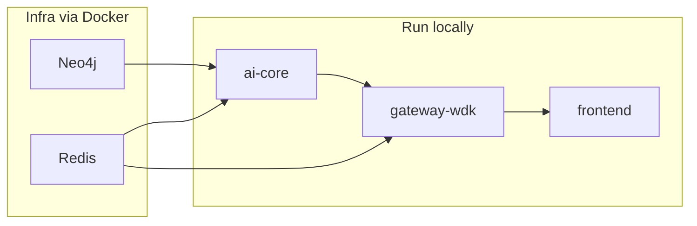

# Contributing

## Development setup

1. Clone the repo and install dependencies per service:
   - `gateway-wdk`: `npm install`
   - `frontend`: `npm install`
   - `ai-core`: `pip install -r requirements.txt`
2. Run infrastructure with Docker: `docker compose -f deploy/docker-compose.yml up neo4j redis` (and any other services you need).
3. Run services locally for hot reload (see [docs/SETUP.md](docs/SETUP.md)).

## Code style

- **TypeScript/JavaScript**: ESLint + Prettier; follow existing patterns in `gateway-wdk` and `frontend`.
- **Python**: Black + Ruff or flake8; type hints where practical in `ai-core`.

## Pull requests

- Keep changes focused; reference the plan or related docs where relevant.
- Ensure tests and lint pass before submitting.
