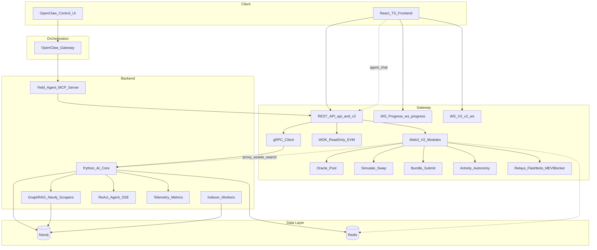

# Dynamic Yield Optimization Agent

A multi-chain DeFi yield optimization agent that uses **Tether WDK** for wallet and transaction handling, a **Neo4j knowledge graph** as the logical layer for protocols and opportunities, and a **Python AI core** (GraphRAG, formulas, and optimization logic) for recommendations. Built for the Tether Hackathon Galactica: WDK Edition 1.

## Problem and solution

- **Problem**: Users hold yield positions across multiple chains and protocols; rebalancing for risk-adjusted return is manual and opaque.
- **Solution**: An agent that (1) connects to the user’s wallet via WDK (non-custodial), (2) reads portfolio and on-chain opportunity data, (3) uses a Neo4j knowledge graph and quant content (formulas, strategies) to recommend actions, and (4) streams progress over WebSocket and executes only after user approval.

## Architecture overview



## Components

| Component | Role |
|-----------|------|
| **Frontend** | **QuantiNova React UI** (`psychic-invention/frontend/`): active frontend — TRANSACT quant workspaces (Pricer, Portfolio, Risk, Optimizer, etc.), **DeFi / Yield** menu with `LiveRates` (WebSocket `/v2/ws/market`), `CitationBadge` `[N]` PDF sources, SSE streaming agent chat, `OptimizationPanel` with progress bar. Talks to gateway (:3000) and ai-core (:8000 via `/api/transact`). |
| **OpenClaw** | Agent orchestration (hackathon-recommended). Control UI at port 18789; uses Yield-Agent MCP tools and Tether WDK skill for conversational yield optimization. |
| **Yield-Agent MCP Server** | MCP server exposing gateway APIs and TRANSACT quant tools: `get_portfolio`, `run_optimization`, `get_optimization_plan`, `broadcast_signed_tx`, plus `quant_var`, `quant_moments`, `explain_formula`, `explain_concept`, `explain_strategy` (9 tools total). OpenClaw connects via HTTP. |
| **Gateway (Node.js/TS)** | REST, WebSocket at `/ws/progress` and `/v2/ws/*`, WDK, gRPC client. Proxies `/api/transact` to ai-core:8000; agent chat rate-limited at 30 req/min (configurable). Exits on startup if `TRANSACT_API_URL`, `NEO4J_URI`, or `REDIS_URL` are missing. |
| **ReAct Agent** | `psychic-invention/app/agents/react_agent.py`: Thought→Action→Observation→Answer loop (max 5 iterations) with `run()` and `stream()` methods; SSE events: intent, thinking, action, observation, final_answer, done. Intent classified by `router.py` (9 intents); conversation history via Redis-backed `memory.py` (20-turn window, 3600 s TTL). |
| **GraphRAG** | Two-tier retrieval: Tier 1 static Neo4j subgraph (concepts, formulas, strategies, protocols + `SOURCED_FROM` citations); Tier 2 dynamic live web scrapers (DeFiLlama TVL/pools, CoinGecko prices, Arxiv papers). PDF citations rendered as `[N]` badges in frontend. |
| **Live Scrapers** | `ai-core/ai_core/scrapers/`: `DeFiLlamaScraper` (2-min cache), `CoinGeckoScraper` (1-min cache), `ArxivScraper` (1-hr cache); run concurrently via `ScraperScheduler`. |
| **Telemetry** | `psychic-invention/app/telemetry.py` + `ai-core/ai_core/telemetry.py`: structlog JSON logging, in-process counters, latency histograms (p99/mean), GraphRAG hit rate. Exposed at `GET /agents/metrics`. |
| **Resilience** | `ai-core/ai_core/resilience.py`: `retry_with_backoff`, `circuit_breaker` (CLOSED/OPEN/HALF_OPEN, `CircuitOpenError`), `async_retry_with_backoff`. Neo4j optimizer wrapped with circuit breaker (threshold 5, timeout 60 s) + retry (2 attempts). |
| **AI Core (Python)** | **One Python gateway**: gRPC (50051) + TRANSACT FastAPI (8000) in one container. Neo4j, Redis; quant APIs (moments, VaR, agents/explain, agents/chat, agents/metrics, agents/feedback). |
| **Indexer** | On-chain data workers that update the Neo4j graph (chains, protocols, opportunities). |
| **Neo4j** | Single source of truth: chains, protocols, assets, opportunities, positions, market context; ingested quant content (Source, Section, Formula); TRANSACT namespace (TransactConcept, TransactFormula, Menu, DeFiProtocol, TradingStrategy, KnowledgeSource). Graph seeded by `graph-seeder` service (16 Cypher files). |
| **Redis** | Caching for portfolio, optimization plans, auth nonces, and agent conversation memory (20-turn sliding window). |

## Quick start

**Prerequisites**: Docker and Docker Compose.

```bash
git clone <repo-url>
cd DoraHacks
docker compose -f deploy/docker-compose.yml up --build
```

| Service | URL | Notes |
|---------|-----|--------|
| Frontend | http://localhost:5173 | TRANSACT app (quant workspaces + DeFi/Yield); Agent chat via OpenClaw when configured. |
| Gateway API | http://localhost:3000 | REST + WebSocket at `ws://localhost:3000/ws/progress`. |
| OpenClaw Control UI | http://localhost:18789 | Full agent UI; use Yield-Agent MCP tools and WDK skill (see [docs/OPENCLAW_INTEGRATION.md](docs/OPENCLAW_INTEGRATION.md)). |
| Yield-Agent MCP | http://localhost:3001 | MCP server for portfolio/optimize/plan/broadcast tools; health at `/health`. |
| Neo4j Browser | http://localhost:7475 | User `neo4j`; password from `NEO4J_PASSWORD` (default `yield-agent-dev`). Bolt on host port **7688**. |

See **[docs/SETUP.md](docs/SETUP.md)** for detailed setup and **[docs/OPENCLAW_INTEGRATION.md](docs/OPENCLAW_INTEGRATION.md)** for OpenClaw and MCP.

## Key features

- **Non-custodial**: Wallet connect and Sign-In with Wallet; transactions signed in the user’s wallet; gateway only fetches data and broadcasts signed payloads.
- **Multi-chain**: WDK supports EVM (Ethereum, Sepolia, L2s), with extensibility for other chains.
- **Real-time UX**: WebSocket stream for optimization progress (FETCHING_DATA → COMPUTING_GRAPH → GENERATING_PLAN → WAITING_FOR_SIGNATURE → DONE); SSE streaming for agent chat (intent/thinking/action/observation/final_answer/done events).
- **ReAct agent loop**: Thought→Action→Observation→Answer (max 5 iterations); keyword-based intent classifier (9 intents); Redis-backed 20-turn conversation memory.
- **GraphRAG two-tier retrieval**: Tier 1 — static Neo4j subgraph (concepts, formulas, strategies, protocols with `SOURCED_FROM` PDF citations); Tier 2 — live DeFiLlama, CoinGecko, and Arxiv scrapers run concurrently. Replies include `[N]` PDF citation badges.
- **Live market data**: `/v2/ws/market` WebSocket polls configured token pairs every 15 s and subscribes to `market:update` Redis pubsub channel; displayed in `LiveRates` frontend component.
- **Graph-backed logic**: Neo4j holds chains, protocols, assets, opportunities, and ingested quant content; TRANSACT namespace adds TransactConcept, TransactFormula, Menu, DeFiProtocol, TradingStrategy, KnowledgeSource with dedicated relationships. Knowledge graph seeded by `graph-seeder` Docker service (16 Cypher files).
- **Caching**: Redis for portfolio, optimization plans, auth nonces, and agent conversation memory to keep data-intensive paths fast.
- **Circuit breaker + retry**: Neo4j optimizer query wrapped with a circuit breaker (failure threshold 5, 60 s recovery) and 2-attempt retry; HTTP calls use `async_retry_with_backoff`.
- **In-process telemetry**: structlog JSON logging, counters, latency histograms (p99/mean), GraphRAG hit rate exposed via `GET /agents/metrics`.
- **TRANSACT integration (mandatory)**: The TRANSACT quant engine runs **inside the ai-core container** (one Python gateway: gRPC + REST on 8000). Gateway proxies `/api/transact` to ai-core:8000. See [docs/SETUP.md](docs/SETUP.md#transact-integration-mandatory).
- **Web3-native v2 surface**: Gateway exposes `/v2` endpoints for oracle/pool data, positions, swap simulation (Flashbots `eth_callBundle`), MEV-protected submission, opportunities, bundle submission, audit trail, and agent autonomy state.

## Documentation

- **[docs/SETUP.md](docs/SETUP.md)** – One-command Docker run, environment reference, local dev, ports, OpenClaw/MCP, ingestion pipeline, troubleshooting.
- **[docs/OPENCLAW_INTEGRATION.md](docs/OPENCLAW_INTEGRATION.md)** – OpenClaw as orchestration layer, Yield-Agent MCP server, config, testing.
- **[docs/WDK_INTEGRATION.md](docs/WDK_INTEGRATION.md)** – Where and how WDK is used (portfolio, auth, execute); OpenClaw + WDK.
- **[docs/DECISION_FLOW.md](docs/DECISION_FLOW.md)** – Agent decision flow, Neo4j schema, WebSocket progress states, OpenClaw orchestration.
- **[docs/API_V2.md](docs/API_V2.md)** – Web3-native `/v2` REST + WebSocket reference (oracle/pool, simulate, bundles, opportunities, activity, autonomy).
- **[CONTRIBUTING.md](CONTRIBUTING.md)** – Dev setup and code style.

## Project structure

```
DoraHacks/
├── psychic-invention/
│   ├── frontend/          # Active React UI: quant workspaces + DeFi/Yield (LiveRates, CitationBadge, SSE chat, OptimizationPanel)
│   └── app/               # Python ReAct agent, GraphRAG, scrapers, telemetry (runs inside ai-core container)
├── gateway-wdk/           # Node.js gateway: REST, WebSocket (/ws/progress + /v2/ws/*), WDK, gRPC client, /api/transact proxy
├── mcp-server-yield-agent/# Yield-Agent MCP server (9 tools: portfolio, optimize, plan, quant + explain_concept/strategy)
├── ai-core/               # Python gRPC + (in Docker) TRANSACT FastAPI = one Python gateway; scrapers, resilience, telemetry
├── indexer/               # On-chain indexer workers
├── proto/                 # gRPC definitions (optimize.proto)
├── deploy/                # Docker Compose, Dockerfile.ai-core-unified, Dockerfile.frontend, Dockerfile.mcp-server
├── docs/                  # SETUP, OPENCLAW_INTEGRATION, WDK_INTEGRATION, DECISION_FLOW, API_V2
└── ai-core/cypher/        # Generated Cypher from pdf_ingest pipeline; seed_graph.sh loads 16 Cypher files
```

## Environment variables (summary)

Create a `.env` in the repo root (see [.env.example](.env.example)). Key variables:

- `NEO4J_PASSWORD` – Neo4j password (default `yield-agent-dev`).
- `REDIS_URL` – Redis URL (in Docker: `redis://redis:6379`).
- `RPC_URL_ETHEREUM`, `RPC_URL_SEPOLIA` – RPC endpoints for portfolio and indexer.
- `OPENCLAW_GATEWAY_URL` – Optional; gateway proxies agent chat to OpenClaw (e.g. `http://openclaw:18789`).
- `AGENT_RATE_LIMIT_PER_MIN` – Per-IP rate limit for `POST /api/agent/chat` (default: `30`).
- `MARKET_PRICE_PAIRS` – Comma-separated token pairs for `/v2/ws/market` polling (e.g. `ETH-USDT,BTC-USDT`).
- `UNIVERSE_DEFAULT_ASSETS` – Default asset list for `/v2/universe/snapshot` (default: `ETH,BTC,USDC,USDT`).
- For host access to Neo4j: use Bolt at `bolt://localhost:7688`.

## License

Apache 2.0. See [LICENSE](LICENSE).
