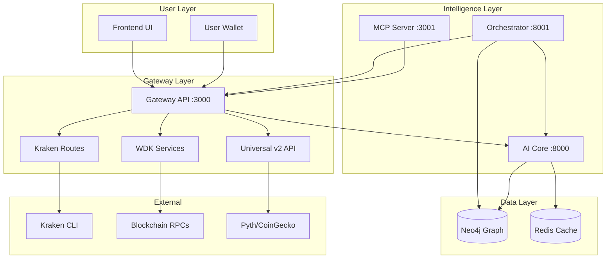

# probable-octo-chainsaw

**Multi-Chain Yield Optimization + Universal Trading Agent**

A financial intelligence platform combining DeFi yield optimization, CEX trading execution, and AI-driven signal generation. Built with Tether WDK for non-custodial wallet operations, Neo4j for knowledge graph reasoning, and pluggable execution venues (Kraken CLI + on-chain protocols).

---

## Architecture in 10 Bullets

| Component | Role | Key Features |
|-----------|------|--------------|
| **1. Neo4j** | Knowledge graph & logical layer | Single source of truth for chains, protocols, assets, opportunities, strategies, and signals. Stores quant content (formulas, concepts) with PDF citations. Dynamic market discovery (no hardcoded assets). GraphRAG retrieval for AI reasoning. |
| **2. Gateway (gateway-wdk)** | API orchestration layer | Node.js/TypeScript REST + WebSocket server. Mounts universal APIs (`/v2/*`), execution venues (`/api/kraken`), and proxies to AI core (`/api/transact`). Non-custodial: never holds keys, only broadcasts signed transactions. |
| **3. Kraken Integration** | Pluggable CEX execution venue | Universal trading pair support (any asset via Kraken CLI). Signal generation (momentum, mean-reversion, breakout). Sandbox-first paper trading. Dynamic Neo4j market creation. Extensible to other exchanges (Binance, Coinbase). |
| **4. WDK (Web3 Data Kit)** | Multi-chain wallet infrastructure | Read-only portfolio fetching (EVM chains). Sign-In with Wallet auth. Non-custodial transaction broadcast. Supports Ethereum, Sepolia, Polygon, with extensibility for Solana/TON/TRON. |
| **5. AI Core (Python)** | Intelligence engine | Unified gateway: gRPC (50051) + FastAPI (8000). Signal generation, GraphRAG retrieval, quant APIs (VaR, moments, formula explanation). Scrapers (CoinGecko, DeFiLlama, Arxiv). Circuit breakers + retry logic for resilience. |
| **6. Orchestrator (LangGraph)** | Agentic Trading Harness | State-machine based orchestration replacing OpenClaw. Sequential flow: Fetch → Analyze → GraphRAG → RL Decide → Risk → Execute. Deep RL (PPO) for trade decisions with KG-backed rationale. |
| **7. MCP Server** | Tool exposure for agents | 9 tools: `get_portfolio`, `run_optimization`, `get_optimization_plan`, `broadcast_signed_tx`, `quant_var`, `quant_moments`, `explain_formula`, `explain_concept`, `explain_strategy`. |
| **8. Frontend (psychic-invention)** | React/TypeScript UI | QuantiNova dashboard: TRANSACT quant workspaces (Pricer, Portfolio, Risk, Optimizer), DeFi/Yield menu with live rates, PDF citation badges `[N]`, SSE agent chat, optimization progress streaming. |
| **9. Redis** | Caching & state management | Portfolio cache (120s TTL), optimization plans, auth nonces, agent conversation memory, market data pub/sub. Enables fast reads and session persistence. |
| **10. Indexer & Scrapers** | Data ingestion pipeline | On-chain workers update Neo4j graph. Live scrapers (DeFiLlama TVL, CoinGecko prices, Arxiv papers) with caching (1-60 min). Two-tier GraphRAG: static Neo4j subgraph + dynamic web data. |

---

## System Flow



---

## Quick Start

**Prerequisites:** Docker, Docker Compose, Node.js 18+, Python 3.12+

```bash
# Clone and start all services
git clone <repo-url>
cd probable-octo-chainsaw
docker compose -f deploy/docker-compose.yml up --build
```

| Service | URL | Purpose |
|---------|-----|---------|
| Frontend | http://localhost:5173 | QuantiNova UI (quant workspaces + DeFi/Yield) |
| Gateway API | http://localhost:3000 | REST + WebSocket (`/ws/progress`, `/v2/ws/*`) |
| Orchestrator | http://localhost:8001 | LangGraph Agentic Trading API |
| MCP Server | http://localhost:3001 | Tool server for agents |
| Neo4j Browser | http://localhost:7474 | Graph database (user: `neo4j`, pass: from `.env`) |
| AI Core | http://localhost:8000 | Python gateway (gRPC + TRANSACT REST) |

See **[docs/SETUP.md](docs/SETUP.md)** for detailed environment configuration.

---

## Key Features

### Yield Optimization (DeFi)
- **Non-custodial portfolio tracking** across EVM chains via WDK
- **Graph-backed opportunity discovery** using Neo4j knowledge graph
- **AI-driven rebalancing recommendations** with risk-adjusted returns
- **WebSocket progress streaming** during optimization (FETCHING_DATA → GENERATING_PLAN → DONE)

### Trading Execution (CEX + On-Chain)
- **Universal Kraken CLI integration** — any trading pair, not hardcoded
- **LangGraph Orchestrator** — state-machine driven trading with automated risk validation
- **Deep RL Integration** — PPO agent for continuous position sizing and trade decisions
- **Sandbox-first paper trading** for safe testing
- **Pluggable execution venue architecture** — extensible to Binance, Coinbase, Uniswap

### AI & Reasoning
- **GraphRAG retrieval** — combines static Neo4j knowledge with live web scrapers
- **Reasoning Harness** — replaces ReAct loops with structured LangGraph state machines
- **Knowledge-Backed Decisions** — trade signals include citations from quant formulas and concepts in Neo4j
- **PDF citation system** — replies include `[N]` badges linking to source documents

### Web3-Native v2 API
- **Dynamic chain discovery** — `/v2/chains` for UI + agent
- **Universe snapshot** — `/v2/universe/snapshot` with tokens, prices, positions
- **Oracle price feeds** — Pyth + CoinGecko with reconciliation
- **MEV-protected execution** — Flashbots Protect / MEV Blocker routing
- **Bundle simulation & submission** — `eth_callBundle` + `eth_sendBundle`
- **Tx audit trail** — Redis-backed activity log with explorer links

---

## Documentation

| Doc | Purpose |
|-----|---------|
| **[docs/SETUP.md](docs/SETUP.md)** | Environment setup, Docker commands, troubleshooting |
| **[docs/WDK_INTEGRATION.md](docs/WDK_INTEGRATION.md)** | WDK usage (portfolio, auth, execute), non-custodial flows |
| **[docs/KRAKEN_UNIVERSAL_INTEGRATION.md](docs/KRAKEN_UNIVERSAL_INTEGRATION.md)** | Kraken CLI integration, universal pair support, signal generation |
| **[docs/LANGGRAPH_ORCHESTRATOR.md](docs/LANGGRAPH_ORCHESTRATOR.md)** | LangGraph Agentic Trading, GraphRAG + Deep RL architecture |
| **[docs/DECISION_FLOW.md](docs/DECISION_FLOW.md)** | Agent decision logic, Neo4j schema, WebSocket states |
| **[docs/API_V2.md](docs/API_V2.md)** | Complete `/v2` REST + WebSocket reference |

---

## Project Structure

```
probable-octo-chainsaw/
├── psychic-invention/
│   ├── frontend/              # React UI: quant workspaces + DeFi/Yield
│   └── app/                   # GraphRAG, scrapers (in ai-core)
│
├── gateway-wdk/
│   └── src/
│       ├── services/          # Kraken, oracle, portfolio, tokenResolver
│       ├── routes/            # Kraken, v2, optimize, execute, agent
│       ├── ws/                # WebSocket handlers (progress, v2)
│       └── lib/               # Redis, chains, relay utilities
│
├── ai-core/
│   ├── ai_core/               # Python gateway: gRPC + FastAPI
│   │   ├── orchestrator/      # LangGraph Trading Harness
│   │   ├── rl/                # Deep RL (PPO) Agent
│   │   └── scrapers/          # CoinGecko, DeFiLlama, Arxiv
│   └── cypher/                # Neo4j schema scripts
│
├── mcp-server-yield-agent/    # MCP tools for agents
├── indexer/                   # On-chain data workers
├── deploy/                    # Docker Compose, Dockerfiles
├── docs/                      # All documentation
└── proto/                     # gRPC definitions (optimize.proto)
```

---

## Environment Variables

Create `.env` in repo root (see [.env.example](.env.example)):

```bash
# Core Services
NEO4J_PASSWORD=yield-agent-dev
REDIS_URL=redis://redis:6379
TRANSACT_API_URL=http://ai-core:8000
ORCHESTRATOR_PORT=8001

# RPC Endpoints (WDK)
RPC_URL_ETHEREUM=https://eth.llamarpc.com
RPC_URL_SEPOLIA=https://sepolia.llamarpc.com
RPC_URL_POLYGON=https://polygon.llamarpc.com

# Kraken CLI (optional)
KRAKEN_API_KEY=<your-key>
KRAKEN_API_SECRET=<your-secret>
KRAKEN_SANDBOX=true
KRAKEN_GATEWAY_URL=http://localhost:3000/api/kraken

# Market Data
MARKET_PRICE_PAIRS=ETH-USDT,BTC-USDT,SOL-USDT
UNIVERSE_DEFAULT_ASSETS=ETH,BTC,USDC,USDT,SOL,MATIC
```

---

## Security Model

- **Non-custodial**: Private keys never leave user's wallet
- **Sandbox-first**: Kraken trading defaults to paper mode
- **Circuit breakers**: Neo4j queries protected with retry + fallback
- **Rate limiting**: Agent chat limited to 30 req/min (configurable)
- **Audit trail**: All transactions logged to Redis with explorer links

---

## License

Apache 2.0 — See [LICENSE](LICENSE)

---

**Built for:** Tether Hackathon Galactica: WDK Edition 1 + LabLab.ai AI Trading Agents  
**Status:** Production-ready (sandbox mode), live trading pending testing
