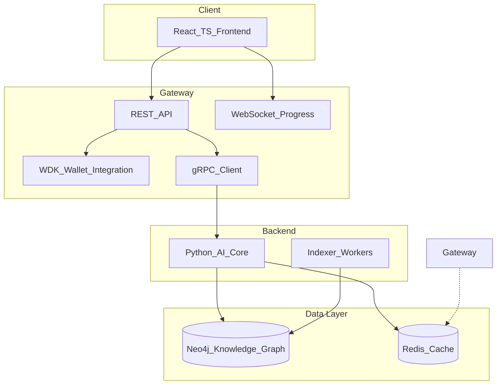

# Dynamic Yield Optimization Agent

A multi-chain DeFi yield optimization agent that uses **Tether WDK** for wallet and transaction handling, a **Neo4j knowledge graph** as the logical layer for protocols and opportunities, and a **Python AI core** (GraphRAG, formulas, and optimization logic) for recommendations. Built for the Tether Hackathon Galactica: WDK Edition 1.

## Problem and solution

- **Problem**: Users hold yield positions across multiple chains and protocols; rebalancing for risk-adjusted return is manual and opaque.
- **Solution**: An agent that (1) connects to the user’s wallet via WDK (non-custodial), (2) reads portfolio and on-chain opportunity data, (3) uses a Neo4j knowledge graph and quant content (formulas, strategies) to recommend actions, and (4) streams progress over WebSocket and executes only after user approval.

## Architecture overview



## Components

| Component | Role |
|-----------|------|
| **Frontend** | React + TypeScript (Vite). Wallet input, portfolio view, “Analyze & Optimize”, live progress via WebSocket, plan view and execute. |
| **Gateway (Node.js/TS)** | REST API, WebSocket at `/ws/progress`, WDK read-only portfolio and auth (nonce/verify). gRPC client to AI core; forwards streamed progress to WebSocket. |
| **AI Core (Python)** | gRPC server, Neo4j as logical layer / knowledge graph. Streams optimization progress; caches plans in Redis. |
| **Indexer** | On-chain data workers that update the Neo4j graph (chains, protocols, opportunities). |
| **Neo4j** | Single source of truth: chains, protocols, assets, opportunities, positions, market context, and ingested quant content (sources, sections, formulas). |
| **Redis** | Caching for portfolio, optimization plans, and auth nonces. |

## Quick start

**Prerequisites**: Docker and Docker Compose.

```bash
git clone <repo-url>
cd DoraHacks
docker compose -f deploy/docker-compose.yml up --build
```

| Service | URL | Notes |
|---------|-----|--------|
| Frontend | http://localhost:5173 | React app (or port 80 if nginx mapping differs) |
| Gateway API | http://localhost:3000 | REST + WebSocket at `ws://localhost:3000/ws/progress` |
| Neo4j Browser | http://localhost:7475 | User `neo4j`; password from `NEO4J_PASSWORD` (default `yield-agent-dev`). Bolt on host port **7688** to avoid conflict with another instance. |

See **[docs/SETUP.md](docs/SETUP.md)** for detailed setup, environment variables, local development, and knowledge-graph ingestion.

## Key features

- **Non-custodial**: Wallet connect and Sign-In with Wallet; transactions signed in the user’s wallet; gateway only fetches data and broadcasts signed payloads.
- **Multi-chain**: WDK supports EVM (Ethereum, Sepolia, L2s), with extensibility for other chains.
- **Real-time UX**: WebSocket stream for optimization progress (FETCHING_DATA → COMPUTING_GRAPH → GENERATING_PLAN → WAITING_FOR_SIGNATURE → DONE).
- **Graph-backed logic**: Neo4j holds chains, protocols, assets, opportunities, and ingested quant content (sources, sections, formulas) for context-aware recommendations.
- **Caching**: Redis for portfolio, optimization plans, and auth nonces to keep data-intensive paths fast.

## Documentation

- **[docs/SETUP.md](docs/SETUP.md)** – One-command Docker run, environment reference, local dev, ports, ingestion pipeline, troubleshooting.
- **[docs/WDK_INTEGRATION.md](docs/WDK_INTEGRATION.md)** – Where and how WDK is used (portfolio, auth, execute).
- **[docs/DECISION_FLOW.md](docs/DECISION_FLOW.md)** – Agent decision flow, Neo4j schema, and WebSocket progress states.
- **[CONTRIBUTING.md](CONTRIBUTING.md)** – Dev setup and code style.

## Project structure

```
DoraHacks/
├── frontend/          # React + TypeScript (Vite), WebSocket progress hook
├── gateway-wdk/       # Node.js gateway: REST, WebSocket, WDK, gRPC client
├── ai-core/           # Python gRPC service, Neo4j schema, optimizer servicer
├── indexer/           # On-chain indexer workers, chain/protocol registry
├── proto/             # gRPC definitions (optimize.proto)
├── deploy/            # Docker Compose and Dockerfiles
├── docs/              # SETUP, WDK_INTEGRATION, DECISION_FLOW
├── AlgorithmicTradingStrategies/  # PDFs for knowledge-graph ingestion
└── ai-core/cypher/    # Generated Cypher from pdf_ingest pipeline
```

## Environment variables (summary)

Create a `.env` in the repo root (see [.env.example](.env.example)). Key variables:

- `NEO4J_PASSWORD` – Neo4j password (default `yield-agent-dev`).
- `REDIS_URL` – Redis URL (in Docker: `redis://redis:6379`).
- `RPC_URL_ETHEREUM`, `RPC_URL_SEPOLIA` – RPC endpoints for portfolio and indexer.
- For host access to Neo4j: use Bolt at `bolt://localhost:7688`.

## License

Apache 2.0. See [LICENSE](LICENSE).
