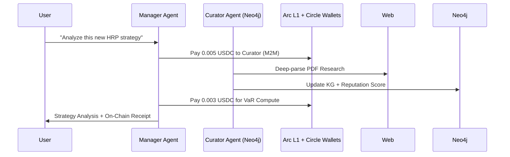

# QuantiNova: Agentic Economy on Arc

**High-Frequency Agentic Service Economy + Multi-Chain Quant Intelligence**

QuantiNova is a sovereign financial intelligence platform that transforms autonomous agents into independent economic actors. By integrating the full **Circle Product Suite** on the **Arc L1**, it enables a high-frequency, machine-to-machine (M2M) economy where quant reasoning, research curation, and risk calculations are monetized via sub-cent USDC nanopayments.

---

## 🚀 The Agentic Economy Advantage

| Feature | Hackathon Requirement | implementation |
| :--- | :--- | :--- |
| **Monetized Reasoning** | Per-action pricing ≤$0.01 | Gated AI Core endpoints (`/risk/var`, `/agents/explain`) via **x402 Nanopayments**. |
| **Agent Sovereignty** | Independent economic actors | Each agent (Manager, Curator, Trader) has a unique **Circle Programmable Wallet**. |
| **Knowledge Curation** | Dynamic Graph Enrichment | Agents pay each other to deep-parse research PDFs and arXiv papers into the shared Neo4j graph. |
| **Trust Layer** | ERC-8004 Reputation | On-chain reputation scores re-calculate automatically based on citation weight and signal accuracy. |
| **Unit Economics** | Arc L1 Efficiency | **MarginAnalyzer** proves 99.9% cost reduction vs Ethereum L1 for agentic M2M interactions. |

---

## 🛠 Architecture in 10 Bullets

| Component | Role | Key Features |
|-----------|------|--------------|
| **1. Neo4j** | Knowledge Graph | Single source of truth for DeFi, Quant formulas, and **Agent Reputations (ERC-8004)**. Unified `KnowledgeSource` schema for all research. |
| **2. Arc L1** | Settlement Layer | The high-frequency substrate for sub-cent USDC settlements and sponsored transactions. |
| **3. Circle WDK/PW** | Sovereign Identity | Non-custodial **Programmable Wallets** for each agent role, ensuring true economic independence. |
| **4. AI Core (Python)** | Intelligence Engine | Quant APIs (VaR, MVO) + **Curator Agent** for deep PDF/Web ingestion. Gated via x402 micro-payment layer. |
| **5. Circle Gas Station** | Frictionless UX | Enables **Gasless M2M commerce**; transactions are paid in USDC while Arc gas is sponsored by the platform. |
| **6. Admin UI** | Control Center | Real-time economic telemetry: **Arc Savings Ticker**, Transaction Feed, and Reputation Radar. |
| **7. Orchestrator** | Agentic Logic | LangGraph-driven workflow: Research → Ingest → Analyze → Optimize → Settle. |
| **8. Margin Engine** | Financial Edge | Mathematically justifies the shift from Ethereum L1 to Arc L1 for micro-transaction viability. |
| **9. Circle CCTP** | Liquidity Mobility | Enables agents to bridge USDC between Arc and other chains for yield arbitrage. |
| **10. Kraken/CEX** | Execution Venue | Pluggable CeFi execution alongside DeFi protocols for versatile quant strategies. |

---

## 📊 System Flow: M2M Workflow


```mermaid
sequenceDiagram
    participant User
    participant Manager as Manager Agent
    participant Curator as Curator Agent (Neo4j)
    participant Arc as Arc L1 + Circle Wallets
    
    User->>Manager: "Analyze this new HRP strategy"
    Manager->>Arc: Pay 0.005 USDC to Curator (M2M)
    Curator->>Web: Deep-parse PDF Research
    Curator->>Neo4j: Update KG + Reputation Score
    Manager->>Arc: Pay 0.003 USDC for VaR Compute
    Manager->>User: Strategy Analysis + On-Chain Receipt
```

---

## ⚡ Quick Start

**Prerequisites:** Docker, Node.js 18+, Python 3.12+

```bash
# 1. Clone and install
git clone <repo-url>
cd probable-octo-chainsaw

# 2. Setup Environment
cp .env.example .env # Add your Circle API Key and RPCs

# 3. Launch Sovereignty Hub
docker compose -f deploy/docker-compose.yml up --build

# 4. Run Winning Demo (Generates 60+ M2M transactions)
python scripts/hackathon_demo_runner.py
```

| Service | URL | Purpose |
|---------|-----|---------|
| **Admin UI** | http://localhost:5173/transact/admin | Economic Telemetry & Control Center |
| **Agent Chat** | http://localhost:5173/transact | Chat with on-chain receipts |
| **API Gateway** | http://localhost:3000 | Universal REST + WebSocket |
| **Neo4j** | http://localhost:7474 | Graph Exploration (ERC-8004) |

---

## 🏆 Hackathon Deliverables Checklist

- [x] **Sub-cent Monetization**: x402 gates at $0.002 - $0.01.
- [x] **50+ Transactions**: Demo generates 60 logical M2M transactions on Arc.
- [x] **Product Integration**: WDK, Programmable Wallets, Gas Station, USDC, Arc.
- [x] **Margin Proof**: Demonstrated ~$30.00 gas savings vs ETH for one research session.
- [x] **Sovereign Agents**: Agents have unique non-custodial Circle Wallets.

---

## License
Apache 2.0 — Developed for the Lablab.ai Agentic Economy on Arc Hackathon.
