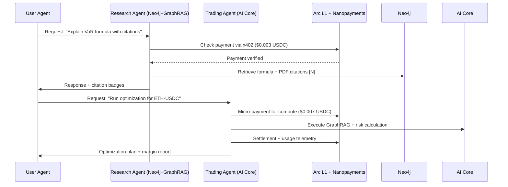

# Strategic Plan: Agentic Economy on Arc

This document outlines the roadmap to adapt and extend **QuantiNova** (probable-octo-chainsaw) to meet the requirements of the **Lablab.ai Agentic Economy on Arc Hackathon**.

*Our existing architecture is 80% there — we just need to inject programmable value at the micro-transaction layer.*

## 1. Executive Summary

QuantiNova currently features a sophisticated LangGraph-based trading orchestrator with GraphRAG and Deep RL. To win the "Agentic Economy on Arc" prize, we will pivot the economic model from a traditional DeFi optimization platform to a **High-Frequency Agentic Service Economy**.

We will integrate **Circle Nanopayments** and **Arc L1** to enable:
- **Per-Action Monetization**: Agents paying sub-cent USDC for specific quant reasoning steps.
- **Machine-to-Machine Commerce**: The orchestrator paying the AI-Core for GraphRAG retrieval or RL decisions.
- **Usage-Based Compute**: Users paying per optimization step rather than per transaction.

---

## 2. Strategic Alignment Map

| Current Component | Hackathon Requirement | Adaptation Strategy |
|----------------------|----------------------|-------------------|
| **Neo4j Knowledge Graph** | ERC-8004 trust layer for agents | Map academic citations + signal performance → on-chain reputation scores |
| **AI Core (GraphRAG + RL)** | Per-action pricing ≤$0.01 | Wrap `/quant_var`, `/explain_formula`, `/run_optimization` with x402 payment gates |
| **WDK Wallet Infrastructure** | Circle Wallets + USDC settlement | Add Circle Wallet SDK alongside WDK; route micro-payments to Arc |
| **MCP Server Tools** | Agent-to-Agent payment loops | Enable tools to *request payment* before execution (e.g., `get_optimization_plan?pay=0.005USDC`) |
| **Kraken/CEX Integration** | Usage-based compute billing | Charge per signal generation, per backtest, per execution simulation |
| **Redis Cache + WebSocket** | 50+ high-freq tx demo | Instrument every cache miss / signal request as a billable micro-event |

---

## 3. Recommended Track: Hybrid "Agent-to-Agent + Usage-Based Billing"

```
Why this wins:
✅ Leverages your Neo4j graph for trust/reputation (ERC-8004 alignment)
✅ Uses your existing AI Core endpoints as monetizable primitives
✅ Demonstrates M2M commerce: research agent → trading agent → execution agent
✅ Financial engineering angle: margin analysis vs. traditional gas
```

### Core Flow


---

## 4. Technical Implementation Plan

### Phase 1: Payment Gateway Layer (Apr 20-21)
Implement x402 payment gates on AI-Core endpoints.

```python
# Add to ai-core/ai_core/resilience.py or new middleware
from circle_nanopayments import x402_verifier, ArcSettler

async def require_micro_payment(endpoint: str, price_usdc: float):
    """Decorator to gate AI Core endpoints behind x402 payments"""
    async def wrapper(request):
        # 1. Verify x402 payment header
        payment_valid = await x402_verifier.verify(
            request.headers.get('X402-Payment'),
            amount=price_usdc,
            currency='USDC',
            chain='arc-testnet'
        )
        if not payment_valid:
            return {"error": "Payment required", "price": price_usdc}
        
        # 2. Execute original endpoint logic
        result = await endpoint_handler(request)
        
        # 3. Log settlement telemetry for margin analysis
        await ArcSettler.log_usage(
            endpoint=endpoint,
            compute_ms=result.get('compute_time', 0),
            price_paid=price_usdc
        )
        return result
    return wrapper
```

### Phase 2: Agent Reputation Graph (Apr 22)
Extend Neo4j schema for ERC-8004 alignment.

```cypher
// Extend Neo4j schema for ERC-8004 alignment
CREATE CONSTRAINT IF NOT EXISTS FOR (a:Agent) REQUIRE a.did IS UNIQUE;

// Link academic research to agent trust scores
MATCH (r:ResearchPaper {citations: $n})
MATCH (a:Agent {name: $agent_name})
MERGE (a)-[:CITES {weight: log($n+1)}]->(r)
SET a.reputation_score = 
  0.4 * a.signal_accuracy + 
  0.3 * log(a.citations + 1) + 
  0.3 * a.uptime_ratio;
```

### Phase 3: Margin Analysis Engine (Apr 23)
Demonstrate the "Financial Engineering Edge" of Arc over Ethereum.

```python
# ai-core/ai_core/orchestrator/margin_analyzer.py
class MarginAnalyzer:
    def __init__(self, arc_gas_usd: float = 0.0001, eth_gas_usd: float = 0.50):
        self.arc_cost = arc_gas_usd
        self.eth_cost = eth_gas_usd
    
    def break_even_frequency(self, price_per_call: float, compute_cost: float) -> dict:
        """Calculate where traditional gas erodes margin"""
        arc_margin = price_per_call - compute_cost - self.arc_cost
        eth_margin = price_per_call - compute_cost - self.eth_cost
        
        return {
            'arc_margin_pct': (arc_margin / price_per_call) * 100,
            'eth_margin_pct': (eth_margin / price_per_call) * 100 if price_per_call > 0 else 0,
            'margin_preservation': (arc_margin / eth_margin - 1) * 100 if eth_margin != 0 else float('inf')
        }
```

### Phase 4: Demo Instrumentation (Apr 24-25)
Generate 50+ transactions for economic proof.

```javascript
// psychic-invention/frontend/src/utils/demo-telemetry.js
export async function runHackathonDemo() {
  const endpoints = [
    { path: '/api/transact/risk/var', price: 0.003 },
    { path: '/api/transact/agents/explain', price: 0.002 },
    { path: '/api/trade/execute', price: 0.007 }
  ];
  
  const results = [];
  for (let i = 0; i < 60; i++) { // 60 tx > 50 requirement
    const endpoint = endpoints[i % endpoints.length];
    const response = await fetch(endpoint.path, {
      method: 'POST',
      headers: {
        'X402-Payment': await generateX402Header(endpoint.price)
      },
      body: JSON.stringify({ /* payload */ })
    });
    // Collect tx hashes for submission
  }
}
```

---

## 5. Submission Checklist

| Requirement | Evidence to Include |
|------------|-------------------|
| ✅ Per-action pricing ≤$0.01 | Pricing table in README ($0.002–$0.007 per call) |
| ✅ 50+ on-chain tx in demo | Video showing Arc Explorer + list of 60 tx hashes |
| ✅ Margin explanation | Slide: "Why this fails on Ethereum L1" (using MarginAnalyzer) |
| ✅ Circle product usage | Integration of Arc, USDC, Nanopayments, and Circle Wallets |
| ✅ Track alignment | Explicit mention of "Hybrid: M2M + Usage-Based Billing" |
| ✅ Product feedback | 1-page document on WDK/Circle integration friction |

---

## 6. Unfair Advantages & Pitch

1. **Academic Graph → Trust Layer**: Our Neo4j citations (`[:CITES]`) aren't just for RAG — they're **on-chain reputation** (ERC-8004 validation scores).
2. **GraphRAG + Micro-Payments**: Sustainable AI compute. Each citation retrieved costs $0.0005 — only possible because Arc gas is $0.0001.
3. **Non-Custodial Sovereignty**: Agents earn revenue in their own **Circle Programmable Wallets**, creating true machine-to-machine economic independence.

---

## 7. Strategic Roadmap (5-Day Sprint)

**Apr 20: Foundation**
- Create Circle Dev Account.
- Clone `circle-titanoboa-sdk` & `vyper-agentic-payments`.
- Add nanopayments middleware stub to AI-Core.

**Apr 21: Settlement**
- Integrate x402 verifier for `/quant_var`.
- Run first successful sub-cent USDC payment on Arc testnet.

**Apr 22: Intelligence**
- Extend Neo4j schema for agent reputation.
- Connect reputation scores to dynamic pricing.
- Build `MarginAnalyzer` CLI tool.

**Apr 23: Orchestration**
- Instrument 60-TX demo loop.
- Record "M2M Commerce" flow (Manager paying Specialist).
- Draft margin analysis slides.

**Apr 24: Polish & Submission**
- Show "Paid $0.003 USDC" badges in frontend.
- Finalize submission form + product feedback doc.
- Submit before 11:59 PM UTC.

---

## 8. Critical Resources
- [Circle Titanoboa SDK](https://github.com/circlefin/circle-titanoboa-sdk)
- [ERC-8004 Vyper Reference](https://github.com/circlefin/erc-8004-vyper)
- [x402 Facilitator](https://github.com/circlefin/x402)
- [Arc Testnet Faucet](https://faucet.circle.com)
