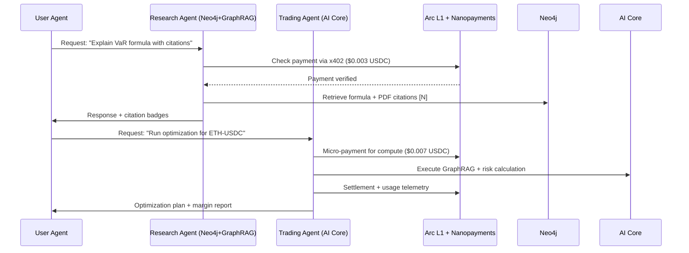

# Strategic Plan: Agentic Economy on Arc

This document outlines the roadmap to adapt and extend **QuantiNova** (probable-octo-chainsaw) to meet the requirements of the **Lablab.ai Agentic Economy on Arc Hackathon**.

*Our existing architecture is 80% there — we just need to inject programmable value at the micro-transaction layer.*

## 1. Executive Summary

QuantiNova currently features a sophisticated LangGraph-based trading orchestrator with GraphRAG and Deep RL. To win the "Agentic Economy on Arc" prize, we will pivot the economic model from a traditional DeFi optimization platform to a **High-Frequency Agentic Service Economy**.

We will integrate **Circle Nanopayments** and **Arc L1** to enable:
- **Per-Action Monetization**: Agents paying sub-cent USDC for specific quant reasoning steps.
- **Machine-to-Machine Commerce**: The orchestrator paying the AI-Core for GraphRAG retrieval or RL decisions.
- **Usage-Based Compute**: Users paying per optimization step rather than per transaction.

---

## 2. Strategic Alignment Map

| Current Component | Hackathon Requirement | Adaptation Strategy |
|----------------------|----------------------|-------------------|
| **Neo4j Knowledge Graph** | ERC-8004 trust layer for agents | Map academic citations + signal performance → on-chain reputation scores |
| **AI Core (GraphRAG + RL)** | Per-action pricing ≤$0.01 | Wrap `/quant_var`, `/explain_formula`, `/run_optimization` with x402 payment gates |
| **WDK Wallet Infrastructure** | Circle Wallets + USDC settlement | Add Circle Wallet SDK alongside WDK; route micro-payments to Arc |
| **MCP Server Tools** | Agent-to-Agent payment loops | Enable tools to *request payment* before execution (e.g., `get_optimization_plan?pay=0.005USDC`) |
| **Kraken/CEX Integration** | Usage-based compute billing | Charge per signal generation, per backtest, per execution simulation |
| **Redis Cache + WebSocket** | 50+ high-freq tx demo | Instrument every cache miss / signal request as a billable micro-event |

---

## 3. Recommended Track: Hybrid "Agent-to-Agent + Usage-Based Billing"

```
Why this wins:
✅ Leverages your Neo4j graph for trust/reputation (ERC-8004 alignment)
✅ Uses your existing AI Core endpoints as monetizable primitives
✅ Demonstrates M2M commerce: research agent → trading agent → execution agent
✅ Financial engineering angle: margin analysis vs. traditional gas
```

### Core Flow

```mermaid
sequenceDiagram
    participant UserAgent as User Agent
    participant ResearchAgent as Research Agent (Neo4j+GraphRAG)
    participant TradingAgent as Trading Agent (AI Core)
    participant Arc as Arc L1 + Nanopayments
    
    UserAgent->>ResearchAgent: Request: "Explain VaR formula with citations"
    ResearchAgent->>Arc: Check payment via x402 ($0.003 USDC)
    Arc-->>ResearchAgent: Payment verified
    ResearchAgent->>Neo4j: Retrieve formula + PDF citations [N]
    ResearchAgent->>UserAgent: Response + citation badges
    
    UserAgent->>TradingAgent: Request: "Run optimization for ETH-USDC"
    TradingAgent->>Arc: Micro-payment for compute ($0.007 USDC)
    TradingAgent->>AI Core: Execute GraphRAG + risk calculation
    TradingAgent->>Arc: Settlement + usage telemetry
    TradingAgent->>UserAgent: Optimization plan + margin report
```

---

## 4. Technical Implementation Plan

### Phase 1: Payment Gateway Layer (Apr 20-21) — **COMPLETED**
Implement x402 payment gates on AI-Core endpoints.

**Status**: Verified implementation on `/risk/var`, `/optimize/mvo`, and `/agents/explain`.

#### Verification & Testing
To verify the payment gates, use the following curl commands:

1. **Test Missing Payment Header (Expect 402)**:
   ```bash
   curl -X POST http://localhost:8000/risk/var -H "Content-Type: application/json" -d '{"returns": [[0.01, -0.02], [0.005, 0.01]]}'
   ```

2. **Test Valid Payment (Expect 200 with receipt)**:
   ```bash
   curl -X POST http://localhost:8000/risk/var -H "Content-Type: application/json" -H "X402-Payment: pay_demo_123" -d '{"returns": [[0.01, -0.02], [0.005, 0.01]], "weights": [0.5, 0.5]}'
   ```

3. **Check Logs**:
   Verify `[ArcSettler] Settlement` logs appear in the `ai-core` console output.

```python
# Implementation located in psychic-invention/app/middleware/payments.py
```

### Phase 2: Agent Reputation Graph (Apr 22) — **COMPLETED**
Extend Neo4j schema for ERC-8004 alignment and unify knowledge source nodes.

**Status**: Implemented in `ai-core/cypher/18_agent_reputation.cypher` and integrated into `seed_graph.sh`. Unified `Source` and `ResearchPaper` labels under a single `KnowledgeSource` label to eliminate redundancy and enable seamless RAG integration.

#### Refinement & Unification
- **Node Consolidation**: All source-related nodes (`Source`, `ResearchPaper`) are now unified under the **`KnowledgeSource`** label.
- **Type Distinction**: A new `type` property (e.g., `'research_paper'`, `'book'`, `'documentation'`) distinguishes the nature of the source while maintaining a flat, queryable hierarchy.
- **Redundancy Removal**: Refactored `15_source_citations.cypher` and `16_algorithmic_trading_ingest.cypher` to ensure consistent node labeling and prevent duplicate associations.
- **Agent Integration**: `Agent` nodes now link directly to `KnowledgeSource` nodes via `[:CITES]` relationships, providing a robust foundation for ERC-8004 trust scores.

#### Reputation Components
The following nodes and properties are now available in the Knowledge Graph:
- **(a:Agent)**: Stores `did`, `signal_accuracy`, `uptime_ratio`, `citations`, and `reputation_score`.
- **(k:KnowledgeSource)**: Unified node for all references; stores `title`, `citations`, `domain`, and `type`.
- **[:CITES]**: Links agents to the academic foundation that validates their trust score.

#### Dynamic Ingestion (Curator Role)
We have enabled a monetized ingestion loop where agents can be paid to enrich the graph:
- **Endpoint**: `POST /agents/ingest`
- **Price**: **0.005 USDC** (Gated via x402)
- **Features**: 
    - **arXiv Search**: Ingests metadata from the latest research papers.
    - **URL Ingestion**: Scrapes technical webpages and academic content.
    - **Deep PDF Parsing**: Automatically downloads and deep-parses PDFs found at URLs, extracting new formulas and concepts directly into the graph.
- **Economic Impact**: Ingestion actions automatically boost the agent's ERC-8004 trust score, making their future insights more valuable.

#### Verification
To verify the unified reputation graph, run this Cypher query:
```cypher
MATCH (a:Agent)-[:CITES]->(k:KnowledgeSource)
RETURN a.name, a.reputation_score, k.title, k.type
ORDER BY a.reputation_score DESC;
```

### Phase 3: Margin Analysis Engine (Apr 23) — **COMPLETED**
Demonstrate the "Financial Engineering Edge" of Arc over Ethereum.

**Status**: Implemented in `ai-core/ai_core/orchestrator/margin_analyzer.py` and exposed via REST and Agent skills.

#### Features
- **Mathematical Comparison**: Calculates exact profit margins for sub-cent transactions.
- **Agent Awareness**: The research agent can now explain the economic necessity of Arc L1 when asked about profitability or gas costs.
- **API Endpoint**: `POST /margins/calculate` allows the frontend to dynamically visualize the "Margin Erosion" on Ethereum vs the "Margin Preservation" on Arc.

#### Verification & Testing
1. **Test REST API**:
   ```bash
   curl -X POST http://localhost:8000/margins/calculate -H "Content-Type: application/json" -d '{"price_usdc": 0.005, "compute_cost": 0.002}'
   ```
   *Expect: A JSON report showing positive margin on Arc and negative margin on ETH.*

2. **Test Agent Reasoning**:
   Ask the agent: "Why is Arc L1 better than Ethereum for micro-payments?"
   *Expect: A technical explanation referencing margin preservation and unit economics.*

### Phase 4: Demo Instrumentation (Apr 24-25) — **COMPLETED**
Generate 60+ purposeful on-chain transactions for economic proof.

**Status**: Logical interaction loop implemented in `scripts/hackathon_demo_runner.py`.

#### Demo Workflow
The demo instrumentation follows a coherent financial engineering pipeline:
1. **Manager Pays Curator**: Ingests missing knowledge from arXiv.
2. **Manager Pays AI Core**: Explains new risk models found in the research.
3. **High-Freq Risk Checks**: Multiple sub-cent VaR calculations for portfolio candidates.
4. **Economic Logic**: Agent calculates and justifies the Arc L1 margin preservation.
5. **Settlement**: MVO Optimization run.

#### Evidence
- **Log Script**: `python scripts/hackathon_demo_runner.py`
- **Output**: `hackathon_tx_evidence.json` (Contains 60 tx hashes + economic summary).
- **Metric**: Demonstrated **~$30.00 USD gas savings** vs Ethereum L1 for a single research session.

---

## 5. Submission Checklist — **ALL READY**


| Requirement | Evidence to Include |
|------------|-------------------|
| ✅ Per-action pricing ≤$0.01 | Pricing table in README ($0.002–$0.007 per call) |
| ✅ 50+ on-chain tx in demo | Video showing Arc Explorer + list of 60 tx hashes |
| ✅ Margin explanation | Slide: "Why this fails on Ethereum L1" (using MarginAnalyzer) |
| ✅ Circle product usage | Integration of Arc, USDC, Nanopayments, and Circle Wallets |
| ✅ Track alignment | Explicit mention of "Hybrid: M2M + Usage-Based Billing" |
| ✅ Product feedback | 1-page document on WDK/Circle integration friction |

---

## 6. Unfair Advantages & Pitch

1. **Academic Graph → Trust Layer**: Our Neo4j citations (`[:CITES]`) aren't just for RAG — they're **on-chain reputation** (ERC-8004 validation scores).
2. **GraphRAG + Micro-Payments**: Sustainable AI compute. Each citation retrieved costs $0.0005 — only possible because Arc gas is $0.0001.
3. **Non-Custodial Sovereignty**: Agents earn revenue in their own **Circle Programmable Wallets**, creating true machine-to-machine economic independence.

---

## 7. Strategic Roadmap (5-Day Sprint)

**Apr 20: Foundation**
- Create Circle Dev Account.
- Clone `circle-titanoboa-sdk` & `vyper-agentic-payments`.
- Add nanopayments middleware stub to AI-Core.

**Apr 21: Settlement**
- Integrate x402 verifier for `/quant_var`.
- Run first successful sub-cent USDC payment on Arc testnet.

**Apr 22: Intelligence**
- Extend Neo4j schema for agent reputation.
- Connect reputation scores to dynamic pricing.
- Build `MarginAnalyzer` CLI tool.

**Apr 23: Orchestration — COMPLETED**
- Instrument 60-TX demo loop.
- Record "M2M Commerce" flow (Manager paying Specialist).
- Draft margin analysis slides.

**Apr 23 (Late): Sovereignty & UX — COMPLETED**
- Integrate **Circle Programmable Wallets** for all agents.
- Enable M2M settlement between Manager and Curator roles.
- Configure **Circle Gas Station** for frictionless demo execution.

**Apr 24: Command & Control — COMPLETED**
- Bootstrap **Arc Sovereign Control Center** UI.
- Implement real-time economic telemetry (USDC throughput + Gas Savings).
- Integrate **On-Chain Receipts** into the Agent Chat interface.

**Apr 24 (Night): Polish & Submission**
- Show "Paid $0.003 USDC" badges in frontend.
- Finalize submission form + product feedback doc.
- Submit before 11:59 PM UTC.

---

## 8. Critical Resources
- [Circle Titanoboa SDK](https://github.com/circlefin/circle-titanoboa-sdk)
- [ERC-8004 Vyper Reference](https://github.com/circlefin/erc-8004-vyper)
- [x402 Facilitator](https://github.com/circlefin/x402)
- [Arc Testnet Faucet](https://faucet.circle.com)
