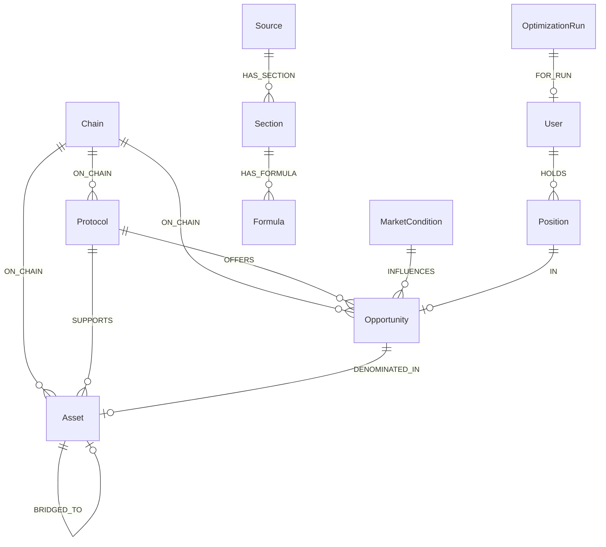
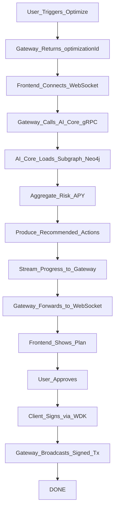
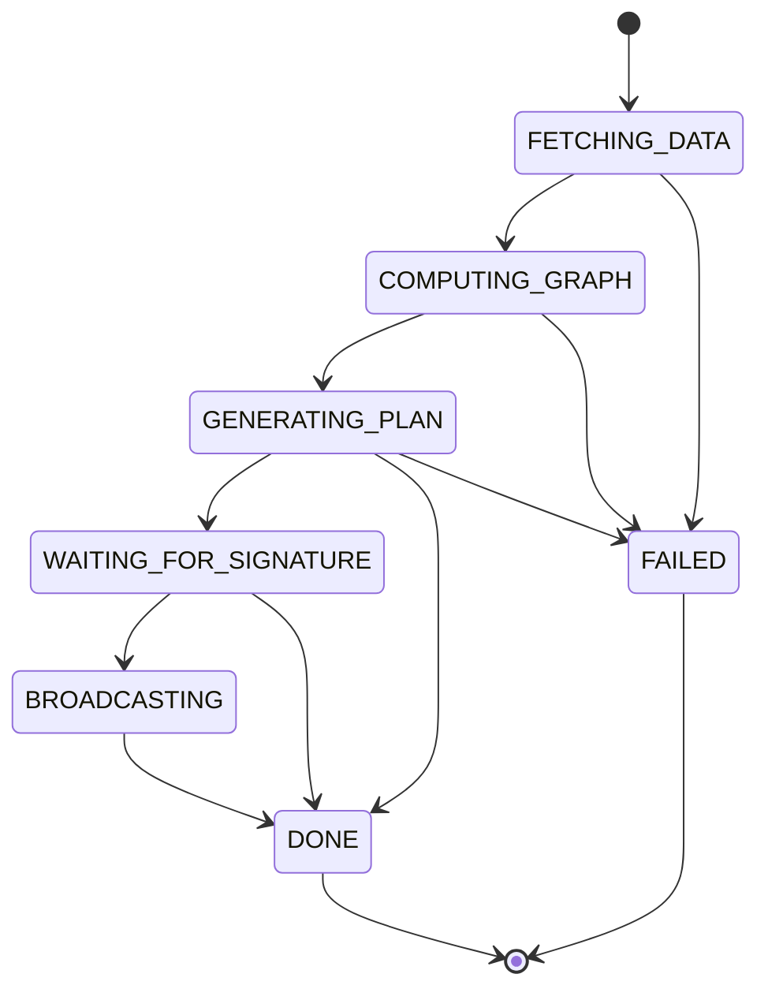

# Agent Decision Flow

The dynamic yield optimization agent uses a **Neo4j knowledge graph** as the logical layer: protocols, assets, opportunities, positions, and market context are stored as nodes and relationships. Decisions are driven by graph queries and (in full implementation) GraphRAG and RL policies.

## Data layer (Neo4j)

- **Nodes**: Chain, Protocol, Asset, Opportunity, MarketCondition, User, Position, OptimizationRun. Ingested content: Source, Section, Formula.
- **Relationships**: ON_CHAIN, SUPPORTS, OFFERS, DENOMINATED_IN, BRIDGED_TO, INFLUENCES, HOLDS, IN, FOR_RUN; for content: HAS_SECTION, HAS_FORMULA.
- Schema and indexes are defined in `ai-core/ai_core/neo4j_schema.py`; the indexer and AI core both read/write this graph.

### Schema overview

## Optimization flow (high level)

1. **Request**: User clicks “Analyze & Optimize”; gateway receives wallet and constraints, returns `optimizationId`, then streams progress over WebSocket.
2. **Data**: Gateway calls AI core via gRPC. AI core loads the subgraph around the user’s positions and candidate opportunities from Neo4j (and optionally market conditions).
3. **Reasoning**: AI core aggregates risk/APY along relationships, runs heuristic or RL policy, and produces a list of recommended actions (e.g. “deposit USDT into Aave on Ethereum”).
4. **Explainability**: Recommendations can be tied back to graph paths; GraphRAG or vector search over the graph can produce natural-language explanations.
5. **Execution**: User approves in the UI; client signs with WDK (or MetaMask); gateway broadcasts via `POST /api/execute/signed`. WebSocket streams status (e.g. WAITING_FOR_SIGNATURE, BROADCASTING, DONE).

## Progress states (WebSocket)

The frontend subscribes to `ws://<gateway>/ws/progress?optimizationId=...` and receives JSON messages with a `status` field. State flow:

| Status | Meaning |
|--------|--------|
| `FETCHING_DATA` | Loading portfolio and graph data. |
| `COMPUTING_GRAPH` | Running graph queries and embeddings. |
| `GENERATING_PLAN` | Producing recommended actions. |
| `WAITING_FOR_SIGNATURE` | Plan ready; awaiting user approval. |
| `BROADCASTING` | Transaction(s) submitted. |
| `DONE` | Optimization and (if any) execution complete. |
| `FAILED` | Error; see `error` field in message. |

The frontend uses the `useOptimizationProgress(optimizationId)` hook to subscribe and show live progress and results.
