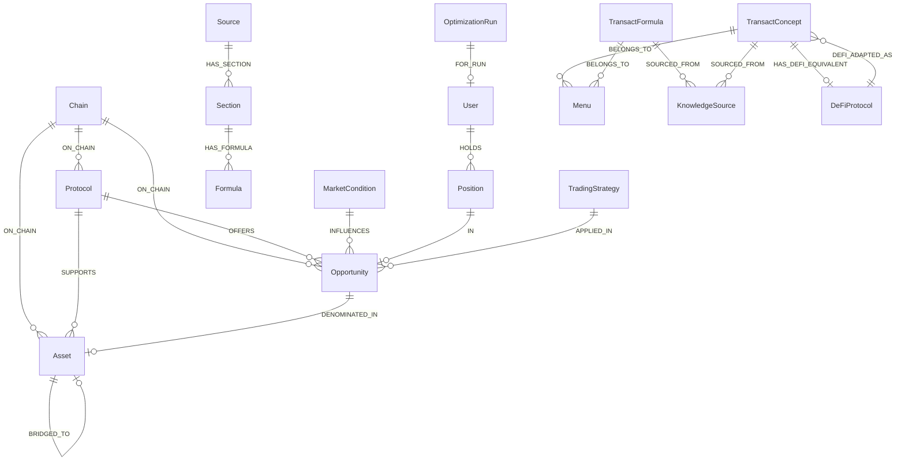
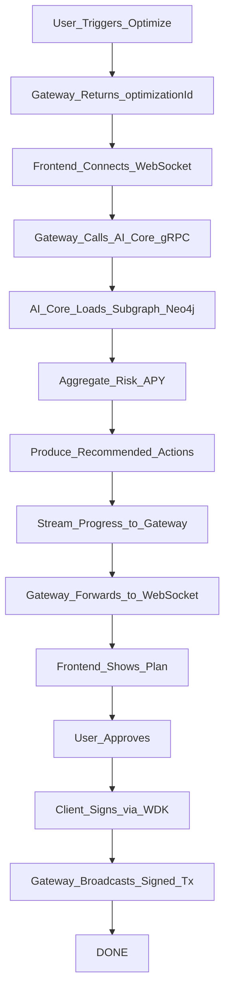
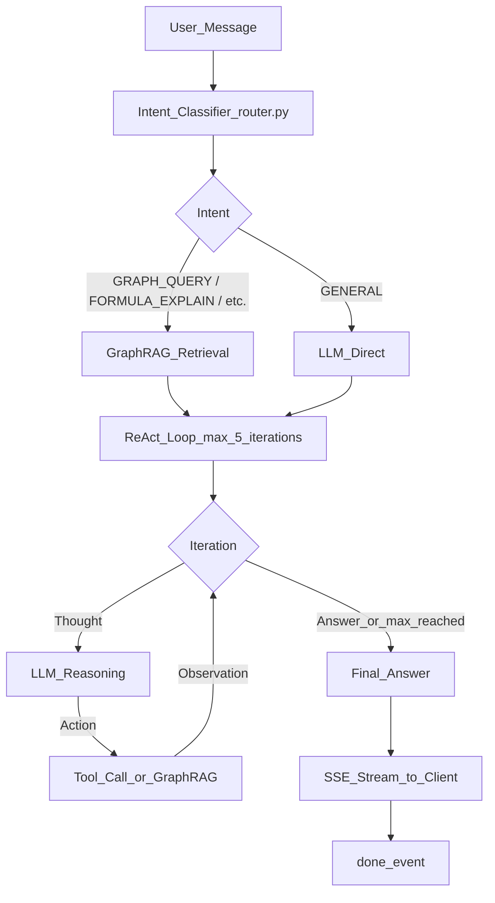
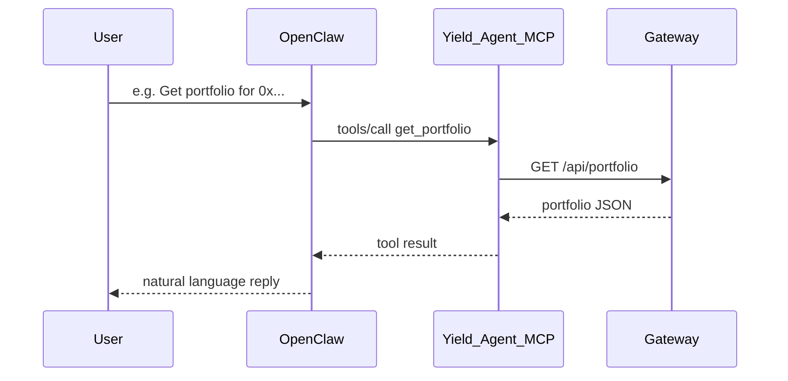
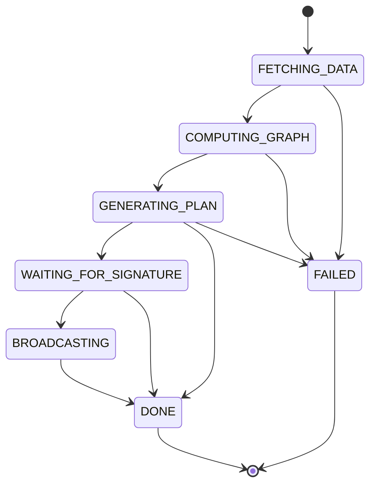

# Agent Decision Flow

The dynamic yield optimization agent uses a **Neo4j knowledge graph** as the logical layer: protocols, assets, opportunities, positions, and market context are stored as nodes and relationships. Decisions are driven by graph queries and (in full implementation) GraphRAG and RL policies.

## Data layer (Neo4j)

- **Nodes**: Chain, Protocol, Asset, Opportunity, MarketCondition, User, Position, OptimizationRun. Ingested content: Source, Section, Formula.
- **TRANSACT namespace nodes** (coexist with legacy): TransactConcept, TransactFormula, Menu, DeFiProtocol, TradingStrategy, KnowledgeSource.
- **Relationships**: ON_CHAIN, SUPPORTS, OFFERS, DENOMINATED_IN, BRIDGED_TO, INFLUENCES, HOLDS, IN, FOR_RUN; for content: HAS_SECTION, HAS_FORMULA.
- **TRANSACT namespace relationships**: SOURCED_FROM (formula/concept → KnowledgeSource), HAS_DEFI_EQUIVALENT (TransactConcept → DeFiProtocol), DEFI_ADAPTED_AS, BELONGS_TO (concept/formula → Menu), APPLIED_IN (TradingStrategy → protocol/opportunity).
- Schema and indexes are defined in `ai-core/ai_core/neo4j_schema.py`; the indexer and AI core both read/write this graph.
- Knowledge graph is seeded by the `graph-seeder` Docker service (`ai-core/scripts/seed_graph.sh`), which runs after Neo4j is healthy, loads all 16 Cypher files in correct dependency order, then exits.

### Schema overview

## Optimization flow (high level)

1. **Request**: User clicks “Analyze & Optimize”; gateway receives wallet and constraints, returns `optimizationId`, then streams progress over WebSocket.
2. **Data**: Gateway calls AI core via gRPC. AI core loads the subgraph around the user’s positions and candidate opportunities from Neo4j (and optionally market conditions).
3. **Reasoning**: AI core aggregates risk/APY along relationships, runs heuristic or RL policy, and produces a list of recommended actions (e.g. “deposit USDT into Aave on Ethereum”). **TRANSACT integration is mandatory**: the AI core calls the TRANSACT API to enrich the plan with quant-level metrics (VaR, portfolio moments) for financial-engineering-grade strategies.
4. **Explainability**: Recommendations can be tied back to graph paths; GraphRAG or vector search over the graph can produce natural-language explanations; TRANSACT provides formula and concept explanations.
5. **Execution**: User approves in the UI; client signs with WDK (or MetaMask); gateway broadcasts via `POST /api/execute/signed`. WebSocket streams status (e.g. WAITING_FOR_SIGNATURE, BROADCASTING, DONE).

## ReAct Agent Loop

The `psychic-invention/app/agents/react_agent.py` implements a Thought→Action→Observation→Answer loop (max 5 iterations) for agent chat. Intent is first classified by `router.py` (9 intents: FORMULA_EXPLAIN, CONCEPT_EXPLAIN, METRIC_INTERPRET, STRATEGY_SUGGEST, WORKSPACE_ANALYZE, DERIVATION, COMPARE, GRAPH_QUERY, GENERAL). Conversation history is maintained by `memory.py` (Redis-backed, 20-turn sliding window, 3600 s TTL, in-process fallback).

SSE events emitted on `POST /agents/chat/stream`: `intent`, `thinking`, `action`, `observation`, `final_answer`, `done`. The `X-Session-Id` response header carries the session identifier for stateful follow-up turns.

## GraphRAG Retrieval

Two-tier retrieval backs every ReAct action and direct knowledge lookup:

- **Tier 1 — Static Neo4j subgraph**: queries TransactConcept, TransactFormula, TradingStrategy, and DeFiProtocol nodes plus `SOURCED_FROM` citations. Returns structured knowledge with PDF source references rendered as `[N]` notation in replies and `CitationBadge` components in the frontend.
- **Tier 2 — Live web scrapers** (`ai-core/ai_core/scrapers/`): `DeFiLlamaScraper` (TVL + top yield pools, 2-min cache), `CoinGeckoScraper` (token prices + global market cap, 1-min cache), `ArxivScraper` (recent quant finance papers, 1-hr cache). All scrapers run concurrently via `ScraperScheduler` using `asyncio.gather`.

GraphRAG hit rate is tracked in telemetry and accessible at `GET /agents/metrics`.

## Agent orchestration (OpenClaw + ReActAgent)

The flow can be driven in two ways:

1. **ReActAgent (direct)**: `POST /agents/chat` or `POST /agents/chat/stream` on ai-core :8000. The ReActAgent classifies intent, retrieves from GraphRAG, runs the Thought/Action/Observation loop, and streams SSE events. Used by the QuantiNova `ChatWindow` component.

2. **OpenClaw**: the user talks to the OpenClaw agent, which uses the **Yield-Agent MCP server** tools: `get_portfolio`, `run_optimization`, `get_optimization_plan`, `broadcast_signed_tx`, and the **mandatory** TRANSACT quant tools `quant_var`, `quant_moments`, `explain_formula`, `explain_concept`, `explain_strategy` (9 tools total). The MCP server forwards tool calls to the gateway and TRANSACT; execution stays non-custodial (signing in the user’s wallet, gateway only broadcasts). OpenClaw Control UI: http://localhost:18789.

See **[docs/OPENCLAW_INTEGRATION.md](OPENCLAW_INTEGRATION.md)** for the full step-by-step setup guide including config file format, tool registration, WDK skill setup, and end-to-end agent conversation examples.

## Progress states (WebSocket)

The frontend subscribes to `ws://<gateway>/ws/progress?optimizationId=...` and receives JSON messages with a `status` field. State flow:

| Status | Meaning |
|--------|--------|
| `FETCHING_DATA` | Loading portfolio and graph data. |
| `COMPUTING_GRAPH` | Running graph queries and embeddings. |
| `GENERATING_PLAN` | Producing recommended actions. |
| `WAITING_FOR_SIGNATURE` | Plan ready; awaiting user approval. |
| `BROADCASTING` | Transaction(s) submitted. |
| `DONE` | Optimization and (if any) execution complete. |
| `FAILED` | Error; see `error` field in message. |

The frontend uses the `useOptimizationProgress(optimizationId)` hook to subscribe and show live progress and results.

---

## Quantitative Strategy Layer (TRANSACT)

TRANSACT is **mandatory**: the AI core will not start without `TRANSACT_API_URL` set. It provides quant-grade metrics that enrich every optimization plan.

### Strategy selection logic

| Market Condition | Preferred Strategy | Why |
|-----------------|-------------------|-----|
| Low correlation, fat-tailed returns | **HRP** (Hierarchical Risk Parity) | Avoids inversion of ill-conditioned covariance; robust to DeFi return instability |
| Sufficient return history (≥60 periods) | **MVO** (Mean-Variance Optimization) | Classic efficient frontier; use only when data is reliable |
| High-confidence edge on a protocol | **Kelly Criterion** | Maximizes log-growth given known edge; size ½-Kelly to cap drawdown |
| Correlated macro views (e.g. ETH bull/bear) | **Black-Litterman** | Blends market-implied returns with analyst views |

### Risk metrics produced per optimization run

| Metric | Endpoint | Meaning |
|--------|----------|---------|
| **VaR (95%)** | `POST /risk/var` | Maximum expected loss over 1 day at 95% confidence |
| **Expected Shortfall** | `POST /risk/var` | Average loss in worst 5% of scenarios |
| **Return / Volatility / Skew / Kurtosis** | `POST /portfolio/moments` | Full distributional characterization of proposed allocation |
| **Funding Rate** | `GET /funding` | Perp/spot funding rate for delta-neutral strategies |
| **On-chain Factors** | `GET /factors/onchain` | TVL, utilization, liquidation risk per protocol |

### MEV and execution risk

The gateway adds execution-layer risk assessment to every recommended action:

- **Swap simulation** (`POST /v2/simulate/swap`): Uniswap V2 `getAmountsOut` via `eth_call`; computes slippage vs oracle reference; flags high-MEV paths
- **MEV protection routing** (`POST /v2/protect/submit`): routes to Flashbots Protect or MEV Blocker based on `protection` parameter
- **Bundle simulation** (`POST /v2/simulate/bundle`): uses Flashbots `eth_callBundle` for real simulation (not a stub)
- **Oracle reconciliation**: Pyth Hermes + CoinGecko cross-validation; rejects if deviation >2%

### Resilience

The Neo4j optimizer query is wrapped with `@circuit_breaker(name="neo4j_optimizer", failure_threshold=5, recovery_timeout=60)` and `@retry_with_backoff(max_attempts=2)` from `ai-core/ai_core/resilience.py`. The circuit breaker transitions through CLOSED → OPEN → HALF_OPEN states; a `CircuitOpenError` is raised when open and returned as a graceful error to the caller. HTTP calls to external services use `async_retry_with_backoff`.
