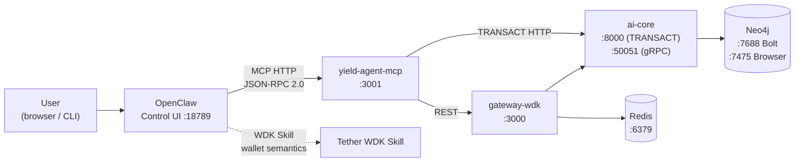

# OpenClaw Integration Guide (DEPRECATED)

> **⚠️ DEPRECATION NOTICE**: OpenClaw utilization has been deprecated in favor of the **LangGraph Trading Orchestrator**. 
> Please refer to **[docs/LANGGRAPH_ORCHESTRATOR.md](LANGGRAPH_ORCHESTRATOR.md)** for the new agentic trading harness documentation.

OpenClaw is the **agent orchestration layer** for the Dynamic Yield Optimization Agent. It runs a conversational AI agent that uses the **Yield-Agent MCP server** as its tool interface and the **Tether WDK skill** for wallet semantics. The agent plans and explains every DeFi action before execution; signing stays non-custodial in the user's wallet.

---

## Table of Contents

1. [Architecture](#architecture)
2. [Prerequisites](#prerequisites)
3. [Quick Start (Docker)](#quick-start-docker)
4. [OpenClaw Config File](#openclaw-config-file)
5. [Registering the MCP Server](#registering-the-mcp-server)
6. [Enabling the Tether WDK Skill](#enabling-the-tether-wdk-skill)
7. [Agent System Prompt](#agent-system-prompt)
8. [MCP Tools Reference](#mcp-tools-reference)
9. [Testing the Integration](#testing-the-integration)
10. [End-to-End Agent Conversation Examples](#end-to-end-agent-conversation-examples)
11. [Agent Autonomy Toggle](#agent-autonomy-toggle)
12. [Agent Chat via React Frontend](#agent-chat-via-react-frontend)
13. [Standalone Setup (Without Docker)](#standalone-setup-without-docker)
14. [Troubleshooting](#troubleshooting)

---

## Architecture



**Data flow summary:**

| Layer | Component | Responsibility |
|-------|-----------|----------------|
| Orchestration | OpenClaw (:18789) | Conversational AI agent; calls MCP tools; explains actions |
| Tool Interface | yield-agent-mcp (:3001) | 9 JSON-RPC tools forwarding to gateway + TRANSACT |
| API Gateway | gateway-wdk (:3000) | REST + WebSocket; WDK read-only portfolio; broadcasts signed txs |
| Intelligence | ai-core (:50051 gRPC / :8000 HTTP) | Neo4j graph optimization + TRANSACT quant enrichment (VaR, moments) |
| Knowledge Graph | Neo4j (:7688) | Chains, protocols, assets, opportunities, positions, formulas |
| Cache | Redis (:6379) | Portfolio TTL cache, optimization plans, autonomy state, audit trail |

**Non-custodial guarantee**: OpenClaw (via MCP) never touches private keys. It fetches portfolio read-only via WDK, runs optimization on Neo4j + TRANSACT, presents the plan, and only broadcasts after the **user signs in their wallet**.

---

## Prerequisites

- **Docker Engine 24+** and **Docker Compose v2+** (recommended path)
- For standalone: **Node.js 20+**, **Python 3.11+**
- An EVM RPC endpoint (Ethereum mainnet/Sepolia at minimum): get a free one from [LlamaRPC](https://llamarpc.com), [Alchemy](https://www.alchemy.com), or [Infura](https://infura.io)
- An EVM wallet address for testing (any address; the agent reads balances read-only)
- OpenClaw Docker image: `ghcr.io/openclaw/openclaw:latest` (requires GHCR authentication — see [OpenClaw docs](https://docs.openclaw.ai) for access)

---

## Quick Start (Docker)

The fastest path spins up the entire stack — Redis, Neo4j, gateway, ai-core (gRPC + TRANSACT), MCP server, OpenClaw, frontend, and indexer — with a single command.

### Step 1 — Clone and configure environment

```bash
# From the repo root
cp .env.example .env
```

Open `.env` and set at minimum:

```bash
# Required: Neo4j password (keep default or change)
NEO4J_PASSWORD=yield-agent-dev

# Required: at least one EVM RPC URL
RPC_URL_ETHEREUM=https://eth.llamarpc.com

# Required for TRANSACT quant tools in MCP (set automatically in Docker via ai-core container)
# TRANSACT_API_URL is set to http://127.0.0.1:8000 inside the unified ai-core container.
# The MCP container uses http://ai-core:8000. No manual action needed for Docker.

# Optional: enable agent chat proxy from React frontend to OpenClaw
OPENCLAW_GATEWAY_URL=http://openclaw:18789
```

For additional chains (Sepolia, Polygon, Arbitrum, Base), add the corresponding RPC URLs:

```bash
RPC_URL_SEPOLIA=https://rpc.sepolia.org
RPC_URL_POLYGON=https://polygon-rpc.com
RPC_URL_ARBITRUM=https://arb1.arbitrum.io/rpc
RPC_URL_BASE=https://mainnet.base.org
```

### Step 2 — Configure OpenClaw

Copy the example config so OpenClaw finds the MCP server on startup:

```bash
# On Linux/macOS
mkdir -p ~/.openclaw
cp deploy/openclaw-config/openclaw.json.example ~/.openclaw/openclaw.json

# On Windows (PowerShell)
New-Item -ItemType Directory -Force -Path "$env:USERPROFILE\.openclaw"
Copy-Item deploy\openclaw-config\openclaw.json.example "$env:USERPROFILE\.openclaw\openclaw.json"
```

> **Docker volume note**: In the `docker-compose.yml` the OpenClaw container mounts a named volume (`openclaw_config`) to `/home/node/.openclaw`. To pre-seed the config, either mount your local `deploy/openclaw-config/` directory or inject the config via the Control UI after startup (see [Registering the MCP Server](#registering-the-mcp-server)).

### Step 3 — Build and start

```bash
docker compose -f deploy/docker-compose.yml up --build
```

Services start in dependency order:
1. **Redis** and **Neo4j** (infrastructure)
2. **gateway-wdk** and **ai-core** (application)
3. **yield-agent-mcp** (after gateway is healthy)
4. **openclaw** (after MCP is healthy)
5. **frontend** and **indexer**

### Step 4 — Verify all services

```bash
# Gateway
curl http://localhost:3000/health
# Expected: {"status":"ok","service":"gateway-wdk"}

# MCP server
curl http://localhost:3001/health
# Expected: {"status":"ok","service":"yield-agent-mcp"}

# OpenClaw Control UI
open http://localhost:18789     # macOS
start http://localhost:18789    # Windows

# Neo4j Browser (login: neo4j / yield-agent-dev)
open http://localhost:7475
```

---

## OpenClaw Config File

The config lives at `deploy/openclaw-config/openclaw.json.example` (copy to `~/.openclaw/openclaw.json` or inject via the Docker volume).

```json
{
  "$schema": "https://docs.openclaw.ai/schemas/openclaw.json",
  "plugins": {
    "entries": {
      "openclaw-mcp-bridge": {
        "enabled": true,
        "config": {
          "servers": [
            {
              "name": "yield-agent",
              "url": "http://yield-agent-mcp:3001",
              "prefix": "yield_agent",
              "healthCheck": true
            }
          ],
          "timeout": 30000,
          "retries": 1
        }
      }
    }
  },
  "agents": {
    "defaults": {
      "systemPrompt": "You help users optimize DeFi yield with quant-level financial-engineering strategies. Use the yield_agent tools: get_portfolio, run_optimization, get_optimization_plan, broadcast_signed_tx, and the TRANSACT quant tools quant_var, quant_moments, explain_formula, explain_concept, explain_strategy when discussing risk, portfolio math, formulas, concepts, or strategies. When the user provides a wallet address, fetch portfolio and run optimization as needed. Always explain recommended actions before execution; signing is done by the user in their wallet (non-custodial)."
    }
  }
}
```

**Field-by-field explanation:**

| Field | Value | Meaning |
|-------|-------|---------|
| `plugins.entries.openclaw-mcp-bridge.enabled` | `true` | Activates the MCP bridge plugin |
| `servers[0].url` | `http://yield-agent-mcp:3001` | Docker service URL; use `http://localhost:3001` when running OpenClaw outside Docker |
| `servers[0].prefix` | `yield_agent` | Namespace for tool names inside OpenClaw (e.g. `yield_agent.get_portfolio`) |
| `servers[0].healthCheck` | `true` | OpenClaw pings `/health` before registering tools |
| `timeout` | `30000` | ms per MCP tool call; keep ≥30 s since gRPC optimization can take a few seconds |
| `agents.defaults.systemPrompt` | (see above) | Base instruction telling the agent to use yield-agent tools and behave non-custodially |

> **URL depending on how OpenClaw runs:**
> - Inside Docker Compose: use `http://yield-agent-mcp:3001` (service name)
> - OpenClaw on host (standalone): use `http://localhost:3001`
> - OpenClaw on a remote server: use the external IP/hostname of the machine running the MCP server

---

## Registering the MCP Server

If you prefer to register via the OpenClaw Control UI instead of editing the JSON file directly:

1. Open **http://localhost:18789**
2. Navigate to **Settings → Plugins → MCP Bridge**
3. Add a new server entry:
   - **Name**: `yield-agent`
   - **URL**: `http://yield-agent-mcp:3001` (Docker) or `http://localhost:3001` (host)
   - **Prefix**: `yield_agent`
   - **Health Check**: enabled
4. Click **Save** and then **Restart Agent**
5. In the chat window, the agent should now see all 9 `yield_agent.*` tools

**Verify tool registration:**

```bash
curl -X POST http://localhost:3001/mcp \
  -H "Content-Type: application/json" \
  -d '{"jsonrpc":"2.0","id":1,"method":"tools/list"}'
```

Expected response (abbreviated):

```json
{
  "jsonrpc": "2.0",
  "id": 1,
  "result": {
    "tools": [
      { "name": "get_portfolio", "description": "Get DeFi portfolio..." },
      { "name": "run_optimization", "description": "Start a yield optimization run..." },
      { "name": "get_optimization_plan", "description": "Get the cached optimization plan..." },
      { "name": "broadcast_signed_tx", "description": "Broadcast an already-signed raw transaction..." },
      { "name": "quant_var", "description": "Compute VaR/ES for a returns matrix..." },
      { "name": "quant_moments", "description": "Compute portfolio moments..." },
      { "name": "explain_formula", "description": "Get explanation of a quant formula..." },
      { "name": "explain_concept", "description": "Explain a TransactConcept from the knowledge graph..." },
      { "name": "explain_strategy", "description": "Explain a TradingStrategy from the knowledge graph..." }
    ]
  }
}
```

---

## Enabling the Tether WDK Skill

The Tether WDK skill teaches OpenClaw wallet and transaction semantics (what a wallet address is, what signing means, what broadcasting does).

**Via ClawHub** (recommended):

1. In OpenClaw Control UI, go to **ClawHub → Skills**
2. Search for **Tether WDK**
3. Click **Install** and then **Enable**

**Via config file** (if ClawHub is unavailable or config-driven setup is preferred):

Add to `openclaw.json` under `plugins.entries`:

```json
"tether-wdk": {
  "enabled": true,
  "config": {
    "networks": ["ethereum", "polygon", "arbitrum", "base", "sepolia"]
  }
}
```

> **Note**: The WDK skill in OpenClaw handles the *vocabulary* of wallets and transactions in the agent's reasoning. Actual signing never happens server-side — the user always signs in their browser wallet (MetaMask, WDK browser extension, etc.).

---

## Agent System Prompt

The default system prompt (from `openclaw.json`) instructs the agent to:

- Use `yield_agent.get_portfolio` when a wallet address is provided
- Use `yield_agent.run_optimization` to start optimization and return an `optimizationId`
- Use `yield_agent.get_optimization_plan` to fetch the recommendation
- Use `yield_agent.quant_var` / `quant_moments` / `explain_formula` / `explain_concept` / `explain_strategy` for risk math, formula explanations, concept lookups, and strategy explanations
- **Always explain** before executing; never skip user approval
- Never sign transactions itself — all signing is done in the user's wallet

To customize the system prompt:

1. Edit the `agents.defaults.systemPrompt` field in `openclaw.json`
2. Restart OpenClaw (`docker compose -f deploy/docker-compose.yml restart openclaw`)

**Example enhanced prompt** for a more quant-focused agent:

```
You are a quantitative DeFi yield optimization agent. You have access to:
- yield_agent.get_portfolio: fetch on-chain balances (EVM)
- yield_agent.run_optimization: trigger Neo4j + TRANSACT graph optimization
- yield_agent.get_optimization_plan: retrieve HRP/MVO/Kelly recommended allocations
- yield_agent.broadcast_signed_tx: broadcast user-signed transactions
- yield_agent.quant_var: compute portfolio VaR and Expected Shortfall
- yield_agent.quant_moments: compute return, volatility, skew, kurtosis
- yield_agent.explain_formula: explain any quant formula from the knowledge graph
- yield_agent.explain_concept: explain a quant/DeFi concept from the knowledge graph
- yield_agent.explain_strategy: explain a TradingStrategy node from the knowledge graph

Always show risk metrics (VaR, volatility) alongside yield recommendations.
Prefer HRP allocations for DeFi due to low return history and fat tails.
Never execute without explicit user approval. All signing is non-custodial.
```

---

## MCP Tools Reference

The MCP server (`mcp-server-yield-agent/src/index.ts`) exposes **9 tools** over HTTP JSON-RPC 2.0 at `POST /mcp`.

### `get_portfolio`

Fetches native + ERC-20 balances for a wallet address via the gateway (WDK read-only, cached 120 s in Redis).

| Parameter | Type | Required | Description |
|-----------|------|----------|-------------|
| `walletAddress` | `string` | Yes | EVM address (`0x...`) |
| `chainId` | `string` | No | Chain slug: `ethereum`, `sepolia`, `polygon`, `arbitrum`, `base` (default: `ethereum`) |

**Example call:**

```bash
curl -X POST http://localhost:3001/mcp \
  -H "Content-Type: application/json" \
  -d '{
    "jsonrpc": "2.0", "id": 1,
    "method": "tools/call",
    "params": {
      "name": "get_portfolio",
      "arguments": {
        "walletAddress": "0xd8dA6BF26964aF9D7eEd9e03E53415D37aA96045",
        "chainId": "ethereum"
      }
    }
  }'
```

**Response shape** (gateway `/api/portfolio`):

```json
{
  "walletAddress": "0xd8dA...",
  "positions": [
    { "symbol": "ETH", "balance": "1.23", "valueUsd": 3456.78, "type": "native" },
    { "symbol": "USDC", "balance": "5000.00", "valueUsd": 5000.00, "type": "erc20" }
  ],
  "totalUsd": 8456.78
}
```

---

### `run_optimization`

Starts an asynchronous yield optimization run using the Neo4j knowledge graph and TRANSACT quant enrichment. Returns an `optimizationId` immediately; the AI core streams progress via gRPC while the agent waits.

| Parameter | Type | Required | Description |
|-----------|------|----------|-------------|
| `walletAddress` | `string` | Yes | EVM address |
| `riskTolerance` | `"low"` \| `"medium"` \| `"high"` | No | Risk profile for optimization |
| `targetChains` | `string[]` | No | e.g. `["ethereum", "polygon"]` |
| `maxGasCostUsd` | `number` | No | Maximum acceptable gas cost in USD |

**Example call:**

```bash
curl -X POST http://localhost:3001/mcp \
  -H "Content-Type: application/json" \
  -d '{
    "jsonrpc": "2.0", "id": 2,
    "method": "tools/call",
    "params": {
      "name": "run_optimization",
      "arguments": {
        "walletAddress": "0xd8dA6BF26964aF9D7eEd9e03E53415D37aA96045",
        "riskTolerance": "medium",
        "targetChains": ["ethereum"]
      }
    }
  }'
```

**Response shape:**

```json
{
  "optimizationId": "a3f7c2e1-4b89-4d56-9abc-def012345678",
  "message": "Optimization started. Use get_optimization_plan with this optimizationId to fetch the plan (wait a few seconds if needed)."
}
```

---

### `get_optimization_plan`

Retrieves the completed optimization plan from Redis cache. If the plan is not yet ready (AI core still computing), returns `404`-equivalent; poll after 2–3 seconds.

| Parameter | Type | Required | Description |
|-----------|------|----------|-------------|
| `optimizationId` | `string` | Yes | UUID from `run_optimization` |

**Response shape** (gateway `/api/execute/plan/:id`):

```json
{
  "optimizationId": "a3f7c2e1-...",
  "actions": [
    {
      "type": "deposit",
      "protocol": "Aave V3",
      "asset": "USDC",
      "chain": "ethereum",
      "amount": "5000",
      "expectedApy": 4.2,
      "riskScore": 0.15
    }
  ],
  "summary": {
    "expectedApy": 4.2,
    "riskScore": 0.15,
    "explanation": "HRP allocation across Aave and Compound; VaR(95%) = $42 on $5000 position..."
  }
}
```

---

### `broadcast_signed_tx`

Broadcasts an already-signed raw transaction hex string. This is the **non-custodial execution step**: the user signed the transaction in their wallet (MetaMask, WDK, Ledger), and this tool submits it to the chain.

| Parameter | Type | Required | Description |
|-----------|------|----------|-------------|
| `signedTxHex` | `string` | Yes | `0x`-prefixed signed transaction hex |
| `chainId` | `string` | No | Chain to submit on (default: `ethereum`) |

**Example:**

```bash
curl -X POST http://localhost:3001/mcp \
  -H "Content-Type: application/json" \
  -d '{
    "jsonrpc": "2.0", "id": 4,
    "method": "tools/call",
    "params": {
      "name": "broadcast_signed_tx",
      "arguments": {
        "signedTxHex": "0x02f86c...",
        "chainId": "ethereum"
      }
    }
  }'
```

---

### `quant_var` (TRANSACT — required)

Computes portfolio **Value-at-Risk (VaR)** and **Expected Shortfall (ES)** from a returns matrix. Calls the TRANSACT `POST /risk/var` endpoint running inside the ai-core container.

| Parameter | Type | Required | Description |
|-----------|------|----------|-------------|
| `returns` | `number[][]` | Yes | T×N matrix (T time periods, N assets) |
| `weights` | `number[]` | No | Portfolio weights summing to 1 (default: equal weight) |
| `alpha` | `number` | No | Confidence level (default: `0.05` for 95% VaR) |
| `portfolioValue` | `number` | No | Portfolio NAV in USD (default: `1`) |

**Example — 5-period, 2-asset portfolio:**

```bash
curl -X POST http://localhost:3001/mcp \
  -H "Content-Type: application/json" \
  -d '{
    "jsonrpc": "2.0", "id": 5,
    "method": "tools/call",
    "params": {
      "name": "quant_var",
      "arguments": {
        "returns": [
          [0.01, -0.02],
          [-0.03, 0.01],
          [0.02, 0.03],
          [-0.01, -0.02],
          [0.04, 0.01]
        ],
        "weights": [0.6, 0.4],
        "alpha": 0.05,
        "portfolioValue": 10000
      }
    }
  }'
```

---

### `quant_moments` (TRANSACT — required)

Computes portfolio statistical moments: expected return, volatility, skewness, and kurtosis. Essential for characterizing DeFi return distributions (which are fat-tailed).

| Parameter | Type | Required | Description |
|-----------|------|----------|-------------|
| `returns` | `number[][]` | Yes | T×N returns matrix |
| `weights` | `number[]` | No | Portfolio weights (default: equal weight) |

---

### `explain_formula` (TRANSACT — required)

Retrieves a natural-language explanation of a quantitative formula from the Neo4j knowledge graph (ingested from `AlgorithmicTradingStrategies/` PDFs). Use when discussing HRP, VaR, Black-Litterman, Kelly Criterion, etc.

| Parameter | Type | Required | Description |
|-----------|------|----------|-------------|
| `formulaName` | `string` | Yes | Formula name e.g. `"Sharpe Ratio"`, `"VaR Historical"`, `"HRP"`, `"Black-Litterman"` |

**Example:**

```bash
curl -X POST http://localhost:3001/mcp \
  -H "Content-Type: application/json" \
  -d '{
    "jsonrpc": "2.0", "id": 7,
    "method": "tools/call",
    "params": {
      "name": "explain_formula",
      "arguments": { "formulaName": "Hierarchical Risk Parity" }
    }
  }'
```

---

### `explain_concept` (TRANSACT — required)

Retrieves a natural-language explanation of a `TransactConcept` node from the TRANSACT knowledge graph. Use when the user asks about a quant or DeFi concept (e.g. impermanent loss, delta neutrality, liquidity mining).

| Parameter | Type | Required | Description |
|-----------|------|----------|-------------|
| `conceptName` | `string` | Yes | Concept name e.g. `"Impermanent Loss"`, `"Delta Neutral"`, `"Liquidity Mining"` |

---

### `explain_strategy` (TRANSACT — required)

Retrieves a natural-language explanation of a `TradingStrategy` node from the TRANSACT knowledge graph, including its `APPLIED_IN` relationships to protocols or opportunities.

| Parameter | Type | Required | Description |
|-----------|------|----------|-------------|
| `strategyName` | `string` | Yes | Strategy name e.g. `"HRP"`, `"Mean-Variance Optimization"`, `"Kelly Criterion"` |

---

## Testing the Integration

Run these tests in order after starting the stack.

### 1. Health checks

```bash
# Gateway
curl http://localhost:3000/health

# MCP server
curl http://localhost:3001/health

# AI Core TRANSACT HTTP
curl http://localhost:8000/cache/health  # or any TRANSACT endpoint

# Neo4j Browser
curl http://localhost:7475
```

### 2. MCP tool discovery

```bash
curl -X POST http://localhost:3001/mcp \
  -H "Content-Type: application/json" \
  -d '{"jsonrpc":"2.0","id":1,"method":"tools/list"}'
```

Expect 9 tools: `get_portfolio`, `run_optimization`, `get_optimization_plan`, `broadcast_signed_tx`, `quant_var`, `quant_moments`, `explain_formula`, `explain_concept`, `explain_strategy`.

### 3. Portfolio fetch (replace address with any EVM address)

```bash
curl -X POST http://localhost:3001/mcp \
  -H "Content-Type: application/json" \
  -d '{
    "jsonrpc":"2.0","id":2,"method":"tools/call",
    "params":{"name":"get_portfolio","arguments":{"walletAddress":"0xd8dA6BF26964aF9D7eEd9e03E53415D37aA96045"}}
  }'
```

### 4. Full optimization flow via MCP

```bash
# Step 1: start optimization
WALLET="0xd8dA6BF26964aF9D7eEd9e03E53415D37aA96045"

OPT_RESPONSE=$(curl -s -X POST http://localhost:3001/mcp \
  -H "Content-Type: application/json" \
  -d "{\"jsonrpc\":\"2.0\",\"id\":3,\"method\":\"tools/call\",\"params\":{\"name\":\"run_optimization\",\"arguments\":{\"walletAddress\":\"$WALLET\",\"riskTolerance\":\"medium\"}}}")

echo $OPT_RESPONSE

# Step 2: extract optimizationId (requires jq)
OPT_ID=$(echo $OPT_RESPONSE | jq -r '.result.content[0].text' | jq -r '.optimizationId')

# Step 3: wait ~3 seconds then fetch plan
sleep 3
curl -X POST http://localhost:3001/mcp \
  -H "Content-Type: application/json" \
  -d "{\"jsonrpc\":\"2.0\",\"id\":4,\"method\":\"tools/call\",\"params\":{\"name\":\"get_optimization_plan\",\"arguments\":{\"optimizationId\":\"$OPT_ID\"}}}"
```

### 5. TRANSACT quant tools

```bash
# VaR
curl -X POST http://localhost:3001/mcp \
  -H "Content-Type: application/json" \
  -d '{
    "jsonrpc":"2.0","id":5,"method":"tools/call",
    "params":{"name":"quant_var","arguments":{
      "returns":[[0.01,-0.02],[-0.03,0.01],[0.02,0.03],[-0.01,-0.02],[0.04,0.01]],
      "weights":[0.6,0.4],"alpha":0.05,"portfolioValue":10000
    }}
  }'

# Moments
curl -X POST http://localhost:3001/mcp \
  -H "Content-Type: application/json" \
  -d '{
    "jsonrpc":"2.0","id":6,"method":"tools/call",
    "params":{"name":"quant_moments","arguments":{
      "returns":[[0.01,-0.02],[-0.03,0.01],[0.02,0.03],[-0.01,-0.02],[0.04,0.01]],
      "weights":[0.6,0.4]
    }}
  }'
```

### 6. OpenClaw Control UI conversation test

1. Open **http://localhost:18789**
2. Start a new conversation
3. Type: `"Get portfolio for 0xd8dA6BF26964aF9D7eEd9e03E53415D37aA96045 on Ethereum"`
4. Agent should call `yield_agent.get_portfolio` and return a natural-language summary of balances
5. Type: `"Run yield optimization for this wallet with medium risk tolerance"`
6. Agent should call `yield_agent.run_optimization`, wait, then call `yield_agent.get_optimization_plan` and present recommended actions
7. Type: `"What is the VaR on this portfolio?"` — agent calls `yield_agent.quant_var`
8. Type: `"Explain Hierarchical Risk Parity"` — agent calls `yield_agent.explain_formula`

---

## End-to-End Agent Conversation Examples

### Example 1: Portfolio + Optimization + Risk

```
User:  Get my portfolio for 0xABC...123 on Ethereum
Agent: [calls yield_agent.get_portfolio]
       Your wallet holds:
         • 2.5 ETH ≈ $7,000
         • 5,000 USDC ≈ $5,000
         Total: ~$12,000

User:  Run optimization with low risk tolerance
Agent: [calls yield_agent.run_optimization → optimizationId: abc-123]
       [waits ~3s, calls yield_agent.get_optimization_plan]
       Recommended allocation:
         • Deposit 5,000 USDC → Aave V3 (Ethereum) at 4.2% APY
         • Keep 2.5 ETH as liquidity buffer
       Risk score: 0.12 (low) | Expected APY: 4.2%

User:  What's the VaR on this?
Agent: [calls yield_agent.quant_var with ETH + USDC returns]
       At 95% confidence:
         Historical VaR: $240 (2% of portfolio)
         Expected Shortfall: $310 (worst 5% average loss)

User:  OK, I'll sign and broadcast the Aave deposit
Agent: Please sign the transaction in your wallet (MetaMask/WDK).
       Once signed, paste the signedTxHex here and I'll broadcast it.

User:  [pastes 0x02f86c...]
Agent: [calls yield_agent.broadcast_signed_tx]
       ✓ Transaction broadcast. TX hash: 0xdeadbeef...
```

### Example 2: Multi-chain Opportunities

```
User:  Show me yield opportunities across Ethereum and Polygon
Agent: [calls yield_agent.run_optimization with targetChains: ["ethereum","polygon"]]
       ...

User:  Explain the Sharpe Ratio formula
Agent: [calls yield_agent.explain_formula with formulaName: "Sharpe Ratio"]
       The Sharpe Ratio measures risk-adjusted return:
         SR = (R_p - R_f) / σ_p
       where R_p is portfolio return, R_f is risk-free rate, σ_p is volatility...
```

---

## Agent Autonomy Toggle

The gateway exposes a Redis-backed autonomy state for the agent. When enabled, the agent can act proactively (e.g., monitor positions and suggest rebalancing). **Circuit breakers and enforcement hooks are not yet fully wired** — treat this as a UI preference flag for now.

```bash
# Enable autonomy for a wallet
curl -X POST http://localhost:3000/v2/agent/toggle \
  -H "Content-Type: application/json" \
  -d '{"autonomous": true, "sessionOrWalletId": "0xYOUR_WALLET"}'

# Disable
curl -X POST http://localhost:3000/v2/agent/toggle \
  -H "Content-Type: application/json" \
  -d '{"autonomous": false, "sessionOrWalletId": "0xYOUR_WALLET"}'
```

Monitor autonomy state via the v2 WebSocket:

```
ws://localhost:3000/v2/ws/agent/0xYOUR_WALLET
```

---

## Agent Chat via React Frontend

When `OPENCLAW_GATEWAY_URL` is set in the gateway environment, the React frontend proxies `POST /api/agent/chat` to OpenClaw (requires chat completions enabled in OpenClaw).

**In Docker** (`docker-compose.yml` already sets this):

```yaml
gateway-wdk:
  environment:
    OPENCLAW_GATEWAY_URL: http://openclaw:18789
    OPENCLAW_TOKEN: ${OPENCLAW_TOKEN:-}  # optional bearer token
```

**Testing from the frontend:**

1. Open http://localhost:5173
2. Navigate to the **Agent** section (or "Analyze & Optimize")
3. Type a message — it proxies to `POST /api/agent/chat` → OpenClaw → MCP tools

**Direct API test:**

```bash
curl -X POST http://localhost:3000/api/agent/chat \
  -H "Content-Type: application/json" \
  -d '{"message": "Get portfolio for 0xd8dA6BF26964aF9D7eEd9e03E53415D37aA96045", "sessionId": "test-session-1"}'
```

---

## Standalone Setup (Without Docker)

If you want to run OpenClaw on your host machine without Docker Compose:

### 1. Start infrastructure

```bash
# Redis
docker run -d -p 6379:6379 --name yield-redis redis:7-alpine

# Neo4j (custom ports to avoid conflicts)
docker run -d -p 7475:7474 -p 7688:7687 \
  -e NEO4J_AUTH=neo4j/yield-agent-dev \
  --name yield-neo4j neo4j:5-community
```

### 2. Start AI Core

```bash
cd ai-core
pip install -r requirements.txt

# Windows PowerShell
$env:NEO4J_URI = "bolt://localhost:7688"
$env:NEO4J_PASSWORD = "yield-agent-dev"
$env:REDIS_URL = "redis://localhost:6379"
$env:TRANSACT_API_URL = "http://127.0.0.1:8000"

# macOS/Linux
export NEO4J_URI=bolt://localhost:7688
export NEO4J_PASSWORD=yield-agent-dev
export REDIS_URL=redis://localhost:6379
export TRANSACT_API_URL=http://127.0.0.1:8000

python -m ai_core.server
# Starts gRPC on :50051 and TRANSACT HTTP on :8000
```

### 3. Start Gateway

```bash
cd gateway-wdk
npm install

# Windows PowerShell
$env:PORT = "3000"
$env:AI_CORE_GRPC_URL = "localhost:50051"
$env:AI_CORE_HTTP_URL = "http://localhost:8000"
$env:REDIS_URL = "redis://localhost:6379"
$env:RPC_URL_ETHEREUM = "https://eth.llamarpc.com"
$env:OPENCLAW_GATEWAY_URL = "http://localhost:18789"

npm run dev
```

### 4. Start MCP Server

```bash
cd mcp-server-yield-agent
npm install

# Windows PowerShell
$env:GATEWAY_URL = "http://localhost:3000"
$env:TRANSACT_API_URL = "http://localhost:8000"
$env:PORT = "3001"

npm run dev
# or: npm start
```

### 5. Run OpenClaw (Docker)

```bash
docker run -d \
  -p 18789:18789 \
  -v "$HOME/.openclaw:/home/node/.openclaw" \
  --name yield-openclaw \
  ghcr.io/openclaw/openclaw:latest
```

Config file at `~/.openclaw/openclaw.json` — use `http://localhost:3001` as the MCP server URL (not the Docker service name, since OpenClaw is connecting from the host to the host):

```json
{
  "plugins": {
    "entries": {
      "openclaw-mcp-bridge": {
        "enabled": true,
        "config": {
          "servers": [
            {
              "name": "yield-agent",
              "url": "http://host.docker.internal:3001",
              "prefix": "yield_agent",
              "healthCheck": true
            }
          ],
          "timeout": 30000,
          "retries": 1
        }
      }
    }
  },
  "agents": {
    "defaults": {
      "systemPrompt": "You help users optimize DeFi yield..."
    }
  }
}
```

> **Windows/macOS**: use `http://host.docker.internal:3001` to reach the host from inside the OpenClaw container.
> **Linux**: use `http://172.17.0.1:3001` (Docker bridge gateway) or `--add-host=host.docker.internal:host-gateway` flag.

---

## Troubleshooting

| Symptom | Likely Cause | Fix |
|---------|-------------|-----|
| **`curl http://localhost:3001/health` → connection refused** | MCP container not running or unhealthy | `docker compose -f deploy/docker-compose.yml ps`; check `yield-agent-mcp` status and logs: `docker logs yield-agent-mcp` |
| **`tools/list` returns empty array** | MCP server started but tools failed to register | Check `TRANSACT_API_URL` is set and ai-core is running; MCP exits if `TRANSACT_API_URL` is missing |
| **MCP server exits: "TRANSACT_API_URL is required"** | TRANSACT_API_URL not set in MCP container env | In Docker: ensure `yield-agent-mcp` service has `TRANSACT_API_URL: http://ai-core:8000` in `docker-compose.yml`. In standalone: `export TRANSACT_API_URL=http://localhost:8000` |
| **OpenClaw can't reach MCP server** | Wrong URL in openclaw.json | From Docker: use `http://yield-agent-mcp:3001`. From host: use `http://localhost:3001` or `http://host.docker.internal:3001` |
| **Agent doesn't see yield_agent tools** | Plugin not enabled or config not loaded | Confirm `openclaw-mcp-bridge.enabled: true` in config; restart OpenClaw; check logs for "MCP bridge registered" |
| **`get_portfolio` returns 500 or empty positions** | Gateway can't reach RPC | Check `RPC_URL_ETHEREUM` is set and valid; `docker logs yield-agent-gateway` for RPC errors |
| **`run_optimization` returns 202 but plan never ready** | AI core unhealthy or Neo4j not seeded | Check `docker logs yield-agent-ai-core`; verify Neo4j is seeded (`curl http://localhost:7475`); look for gRPC errors |
| **`quant_var` / `quant_moments` return TRANSACT error** | ai-core TRANSACT HTTP not responding | `curl http://localhost:8000/cache/health`; check ai-core container logs; ensure TRANSACT FastAPI started inside the unified container |
| **Agent chat in frontend returns 503** | `OPENCLAW_GATEWAY_URL` not set or OpenClaw not running | Set `OPENCLAW_GATEWAY_URL=http://openclaw:18789` in gateway env; verify OpenClaw container is healthy |
| **OpenClaw image pull fails** | GHCR auth required | `docker login ghcr.io` with a GitHub token that has `read:packages` scope; or check [OpenClaw docs](https://docs.openclaw.ai) for public image access |
| **Neo4j connection refused** | Wrong Bolt port for host connections | From host use `bolt://localhost:7688` (mapped from container 7687); from inside Docker use `bolt://neo4j:7687` |
| **WebSocket progress never reaches DONE** | AI core can't connect to Neo4j | Check `NEO4J_URI=bolt://neo4j:7687` in ai-core container; verify Neo4j healthcheck passes |
| **WDK skill not found in OpenClaw** | Skill not installed from ClawHub | Go to ClawHub → Skills → Tether WDK → Install + Enable; or add manually to config plugins |

### Useful diagnostic commands

```bash
# View all service statuses
docker compose -f deploy/docker-compose.yml ps

# Tail all logs
docker compose -f deploy/docker-compose.yml logs -f

# Tail specific service
docker logs -f yield-agent-mcp
docker logs -f yield-agent-gateway
docker logs -f yield-agent-ai-core
docker logs -f yield-agent-openclaw

# Check Neo4j seed data (via Bolt shell)
docker exec -it yield-agent-neo4j cypher-shell -u neo4j -p yield-agent-dev \
  "MATCH (n) RETURN labels(n), count(n) ORDER BY count(n) DESC"

# Check Redis cache keys
docker exec -it yield-agent-redis redis-cli keys "*"

# Force restart a single service
docker compose -f deploy/docker-compose.yml restart yield-agent-mcp
```

---

## Related Documentation

- [docs/SETUP.md](SETUP.md) — Full environment setup, Docker + local dev, testing scripts
- [docs/DECISION_FLOW.md](DECISION_FLOW.md) — Neo4j schema, optimization flow, progress states
- [docs/WDK_INTEGRATION.md](WDK_INTEGRATION.md) — Non-custodial WDK portfolio + execution flows
- [docs/API_V2.md](API_V2.md) — Web3-native `/v2` REST + WebSocket API reference
- [deploy/openclaw-config/openclaw.json.example](../deploy/openclaw-config/openclaw.json.example) — Ready-to-use OpenClaw config
- [mcp-server-yield-agent/src/index.ts](../mcp-server-yield-agent/src/index.ts) — MCP server source (9 tools)
