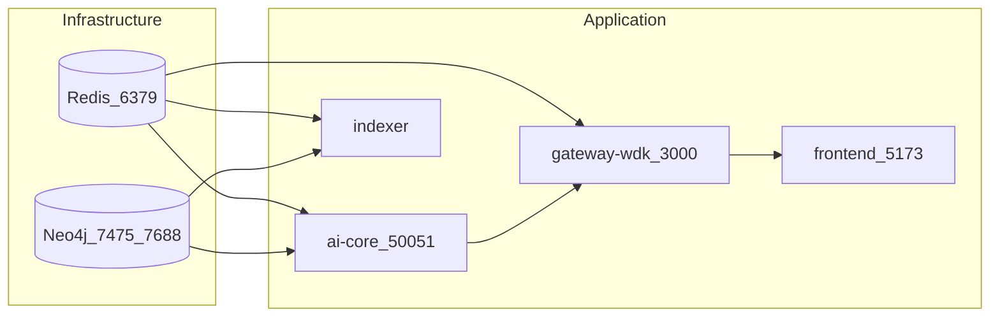

# Setup

This guide covers one-command Docker run, environment variables, local development, knowledge-graph ingestion, and troubleshooting.

## Prerequisites

- **Docker** and **Docker Compose** (v2+).
- For local development: **Node.js 20+**, **Python 3.11+**, **npm**.

## One-command run (Docker)

From the repo root:

```bash
docker compose -f deploy/docker-compose.yml up --build
```

Services start in dependency order (Redis and Neo4j first, then gateway, ai-core, frontend, indexer). The following diagram summarizes service dependencies and exposed ports.



### Endpoints and ports

| Service | Host port | Purpose |
|---------|-----------|---------|
| **Frontend** | 5173 | React app (Vite dev or nginx-served build). |
| **Gateway** | 3000 | REST API and WebSocket at `ws://localhost:3000/ws/progress`. |
| **Neo4j Browser** | 7475 | Web UI for Cypher and graph exploration. |
| **Neo4j Bolt** | 7688 | Driver connections (e.g. from host: `bolt://localhost:7688`). |
| **AI Core gRPC** | 50051 | Internal; gateway connects to `ai-core:50051`. |
| **Redis** | 6379 | Cache; used by gateway and ai-core. |

### First-time checks

1. **Neo4j**: Open http://localhost:7475. Log in with user `neo4j` and password from `NEO4J_PASSWORD` (default `yield-agent-dev`).
2. **Gateway**: http://localhost:3000/health should return `{"status":"ok","service":"gateway-wdk"}`.
3. **Frontend**: Open http://localhost:5173, enter a wallet address, and run “Analyze & Optimize” to see WebSocket progress and plan.

---

## Environment variables

Create a `.env` file in the repo root (or export in the shell). Example:

```bash
# Neo4j (this stack uses host ports 7475 and 7688)
NEO4J_PASSWORD=yield-agent-dev

# Redis (required for gateway and ai-core)
REDIS_URL=redis://redis:6379

# RPC endpoints (gateway portfolio + indexer)
RPC_URL_ETHEREUM=https://eth.llamarpc.com
RPC_URL_SEPOLIA=https://rpc.sepolia.org
```

### Reference

| Variable | Default (Docker) | Description |
|----------|------------------|-------------|
| `NEO4J_PASSWORD` | `yield-agent-dev` | Neo4j password (user is `neo4j`). |
| `NEO4J_URI` | (internal) | For **host** access to this stack’s Neo4j use `bolt://localhost:7688`. |
| `REDIS_URL` | `redis://redis:6379` | Redis connection string. |
| `RPC_URL_ETHEREUM` | (see .env.example) | Ethereum RPC for portfolio and indexer. |
| `RPC_URL_SEPOLIA` | (see .env.example) | Sepolia RPC. |
| `AI_CORE_GRPC_URL` | `ai-core:50051` | Used by gateway inside Docker. |
| `PORT` | 3000 | Gateway listen port. |
| `VITE_GATEWAY_URL` / `VITE_WS_URL` | (build-time) | Set when building frontend for production to point to your gateway. |

---

## Local development (without full Docker stack)

Run infrastructure in Docker, then run gateway, ai-core, and frontend on the host.

### 1. Redis

```bash
docker run -d -p 6379:6379 --name yield-redis redis:7-alpine
```

### 2. Neo4j (custom ports to avoid conflict)

```bash
docker run -d -p 7475:7474 -p 7688:7687 -e NEO4J_AUTH=neo4j/yield-agent-dev --name yield-neo4j neo4j:5-community
```

Connect from host with `NEO4J_URI=bolt://localhost:7688`.

### 3. AI Core

```bash
cd ai-core
pip install -r requirements.txt
# Optional: generate gRPC stubs if not present (see below)
set NEO4J_URI=bolt://localhost:7688
set NEO4J_PASSWORD=yield-agent-dev
set REDIS_URL=redis://localhost:6379
python -m ai_core.server
```

AI core will apply the Neo4j schema and seed data, then start the gRPC server on port 50051.

### 4. Gateway

```bash
cd gateway-wdk
npm install
set PORT=3000
set AI_CORE_GRPC_URL=localhost:50051
set REDIS_URL=redis://localhost:6379
set RPC_URL_ETHEREUM=https://eth.llamarpc.com
npm run dev
```

### 5. Frontend

```bash
cd frontend
npm install
npm run dev
```

Open http://localhost:5173. The Vite dev server proxies `/api` and `/ws` to the gateway (port 3000).

### 6. Indexer (optional)

```bash
cd indexer
npm install
set NEO4J_URI=bolt://localhost:7688
set NEO4J_PASSWORD=yield-agent-dev
set REDIS_URL=redis://localhost:6379
npm run dev
```

---

## Knowledge-graph ingestion (PDF → Cypher)

The pipeline reads PDFs from `AlgorithmicTradingStrategies/`, extracts table-of-contents structure and formulas with context, and emits Cypher for Neo4j.

### Run the ingestion script

From the repo root, with the `ai-core` environment active:

```bash
cd ai-core
pip install -r requirements.txt
# Ensure pymupdf is installed (pip install pymupdf)
python -m ai_core.pdf_ingest
```

Output: `ai-core/cypher/algorithmic_trading_ingest.cypher`.

### Load Cypher into Neo4j

- **Neo4j Browser**: Open the script file, paste its contents into the query box, and run (or run in chunks if very large).
- **cypher-shell**: `cypher-shell -a bolt://localhost:7688 -u neo4j -p <password> < ai-core/cypher/algorithmic_trading_ingest.cypher`

The script creates `Source`, `Section`, and `Formula` nodes and `HAS_SECTION` / `HAS_FORMULA` relationships. Ensure the Neo4j schema (and any constraints for these node types) are applied before loading.

---

## Troubleshooting

### Gateway health check fails in Docker

- Ensure Redis and Neo4j are healthy (e.g. `docker compose -f deploy/docker-compose.yml ps`).
- Gateway depends on Redis; it exits if it cannot connect. Check `REDIS_URL` and that the redis service is up.
- If AI core is down, the gateway still starts and falls back to a mock optimization stream.

### WebSocket connection refused or 404

- Confirm the gateway is listening on port 3000 and that the frontend is using the correct URL (e.g. `ws://localhost:3000/ws/progress?optimizationId=...`).
- In production, set `VITE_WS_URL` and `VITE_GATEWAY_URL` at frontend build time so the client points to your gateway host.

### Neo4j connection from host

- Use **Bolt** at `bolt://localhost:7688` (host port 7688 maps to container 7687).
- Use **Browser** at http://localhost:7475.

### gRPC / AI core not reached

- From the gateway container, `AI_CORE_GRPC_URL` must be `ai-core:50051` (service name). From host, use `localhost:50051` when running the AI core locally.
- If the AI core is unavailable, the gateway uses a mock progress stream so the UI still works.

### Frontend build (Docker) fails

- Ensure `frontend/package.json` exists and that the build stage can run `npm install` (network access). If you use `npm ci`, a valid `package-lock.json` must be present and in sync with `package.json`.

### PDF ingestion: “fitz” or “frontend” import error

- Use **PyMuPDF** only: `pip install pymupdf`. The script uses `import pymupdf` to avoid conflict with the unrelated PyPI package `fitz`.
- If you still see a “frontend” or “static/” error, run `pip uninstall fitz` and then `pip install pymupdf`.
