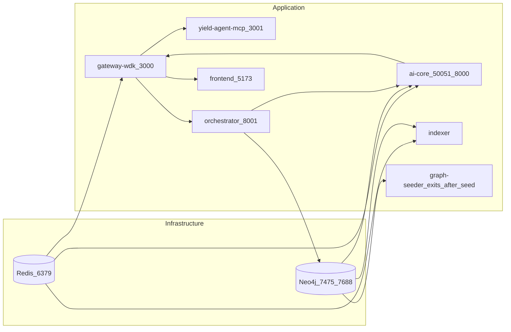

# Setup Guide

This guide covers one-command Docker setup, all environment variables, local development, knowledge-graph ingestion, and troubleshooting.

---

## Table of Contents

1. [Prerequisites](#prerequisites)
2. [One-Command Docker Run](#one-command-docker-run-recommended)
3. [Service Endpoints](#service-endpoints)
4. [Environment Variables](#environment-variables)
5. [LangGraph Orchestrator](#langgraph-orchestrator)
6. [TRANSACT Integration](#transact-integration-mandatory)
7. [Local Development (Without Docker)](#local-development-without-docker)
8. [Knowledge-Graph Ingestion (PDF → Cypher)](#knowledge-graph-ingestion-pdf--cypher)
9. [Testing Scripts](#testing-scripts)
10. [Troubleshooting](#troubleshooting)

---

## Prerequisites

- **Docker Engine 24+** and **Docker Compose v2+** (for Docker setup)
- **Node.js 20+** and **Python 3.11+** (for local development only)
- At least one EVM RPC URL (Ethereum mainnet or Sepolia; see environment variables)

---

## One-Command Docker Run (recommended)

```bash
# From the repo root
cp .env.example .env          # Edit .env with your RPC URLs
docker compose -f deploy/docker-compose.yml up --build
```

Services start in dependency order (Redis and Neo4j first, then gateway, ai-core, yield-agent-mcp, openclaw, frontend, indexer). The `graph-seeder` service runs after Neo4j is healthy, seeds all 16 Cypher files via `ai-core/scripts/seed_graph.sh`, then exits. All services include health checks.



---

## Service Endpoints

| Service | Host Port | Purpose |
|---------|-----------|---------|
| **Frontend** | 5173 | React/Vite TRANSACT app (DeFi yield + quant workspaces) |
| **Gateway** | 3000 | REST API + WebSocket (`ws://localhost:3000/ws/progress`) |
| **Orchestrator** | 8001 | LangGraph Agentic Trading API; GraphRAG + Deep RL |
| **Yield-Agent MCP** | 3001 | MCP server (9 tools: portfolio, optimize, plan, broadcast, VaR, moments, formula, concept, strategy) |
| **AI Core gRPC** | 50051 | Internal; gateway connects to `ai-core:50051` for optimization |
| **AI Core HTTP (TRANSACT)** | 8000 | Quant REST API (`/risk/var`, `/portfolio/moments`, `/agents/explain`, etc.) |
| **Neo4j Browser** | 7475 | Web UI for Cypher and graph exploration |
| **Neo4j Bolt** | 7688 | Driver connections from host (`bolt://localhost:7688`) |
| **Redis** | 6379 | Cache; portfolio TTL, optimization plans, audit trail, autonomy state |

### First-time checks

1. **Neo4j**: http://localhost:7475 — log in with `neo4j` / `yield-agent-dev` (or your `NEO4J_PASSWORD`)
2. **Gateway**: `curl http://localhost:3000/health` → `{"status":"ok","service":"gateway-wdk"}`
3. **MCP server**: `curl http://localhost:3001/health` → `{"status":"ok","service":"yield-agent-mcp"}`
4. **Orchestrator**: `curl http://localhost:8001/health` → `{"status":"healthy","architecture":"LangGraph + GraphRAG + Deep RL (PPO)"}`
5. **Frontend**: http://localhost:5173 — DeFi / Yield tab for portfolio, optimize, plan

---

## Environment Variables

Create a `.env` file at the repo root. The Docker Compose file reads from it automatically.

```bash
# Copy the example
cp .env.example .env
```

### Minimal `.env` for Docker

```bash
# Neo4j
NEO4J_PASSWORD=yield-agent-dev

# Redis (set automatically in Docker; only needed for standalone)
# REDIS_URL=redis://localhost:6379

# RPC endpoints (at least one EVM required)
RPC_URL_ETHEREUM=https://eth.llamarpc.com
RPC_URL_SEPOLIA=https://rpc.sepolia.org
```

### Full Environment Variable Reference

| Variable | Docker Default | Description |
|----------|----------------|-------------|
| `NEO4J_PASSWORD` | `yield-agent-dev` | Neo4j password (user is `neo4j`). |
| `NEO4J_AUTH` | `neo4j/yield-agent-dev` | Full auth string passed to Neo4j container. |
| `NEO4J_URI` | `bolt://neo4j:7687` (Docker) | Bolt URI. From host: `bolt://localhost:7688`. |
| `REDIS_URL` | `redis://redis:6379` | Redis connection string (gateway and ai-core). |
| `RPC_URL_ETHEREUM` | `https://eth.llamarpc.com` | Ethereum mainnet RPC (portfolio, indexer, oracle). |
| `RPC_URL_SEPOLIA` | `https://rpc.sepolia.org` | Sepolia testnet RPC. |
| `RPC_URL_POLYGON` | _(not set)_ | Polygon RPC (e.g. `https://polygon-rpc.com`). |
| `RPC_URL_ARBITRUM` | _(not set)_ | Arbitrum RPC (e.g. `https://arb1.arbitrum.io/rpc`). |
| `RPC_URL_BASE` | _(not set)_ | Base RPC (e.g. `https://mainnet.base.org`). |
| `RPC_URL_SOLANA` | _(not set)_ | Solana RPC (scaffold only; WDK module not yet installed). |
| `RPC_URL_TON` | _(not set)_ | TON RPC (scaffold only). |
| `RPC_URL_TRON` | _(not set)_ | TRON RPC (scaffold only). |
| `PORT` | `3000` | Gateway listen port. |
| `AI_CORE_GRPC_URL` | `ai-core:50051` | gRPC target; from host use `localhost:50051`. |
| `AI_CORE_HTTP_URL` | `http://ai-core:8000` | Gateway proxies `/api/transact` to this. |
| `TRANSACT_API_URL` | `http://127.0.0.1:8000` (ai-core) / `http://ai-core:8000` (MCP) | TRANSACT quant engine URL. In unified Docker container, ai-core sets this to loopback. MCP uses the service name. **Required** — both ai-core and MCP exit if unset. |
| `GATEWAY_URL` | `http://gateway-wdk:3000` | Used by MCP server to call gateway APIs. |
| `ORCHESTRATOR_PORT` | `8001` | Port for the LangGraph Orchestrator API. |
| `WDK_NETWORKS` | _(empty)_ | Comma-separated extra WDK networks to enable. |
| `VITE_GATEWAY_URL` | `http://localhost:3000` | Build-time; frontend API base URL. |
| `VITE_WS_URL` | `ws://localhost:3000` | Build-time; frontend WebSocket base URL. |
| `VITE_API_URL` | `http://localhost:3000/api/transact` | Build-time; TRANSACT API URL for frontend. |
| `UNISWAP_V2_ROUTER_ETHEREUM` | _(not set)_ | Uniswap V2 router address for swap simulation (defaults to `0x7a250d5630B4cF539739dF2C5dAcb4c659F2488D`). |
| `FLASHBOTS_RPC_URL` | `https://rpc.flashbots.net` | Flashbots Protect RPC for MEV-protected submit. |
| `MEV_BLOCKER_RPC_URL` | `https://rpc.mevblocker.io` | MEV Blocker RPC. |
| `FLASHBOTS_RELAY_URL` | `https://relay.flashbots.net` | Flashbots relay for bundle submission (Ethereum mainnet only). |
| `PORTFOLIO_TOKEN_SYMBOLS` | `USDT,USDC` | Comma-separated ERC-20 symbols to fetch in portfolio reads. |
| `AGENT_RATE_LIMIT_PER_MIN` | `30` | Per-IP rate limit for `POST /api/agent/chat` (requests per minute). |
| `MARKET_PRICE_PAIRS` | `ETH-USDT,BTC-USDT` | Comma-separated price pairs polled by the `/v2/ws/market` WebSocket every 15 s. |
| `UNIVERSE_DEFAULT_ASSETS` | `ETH,BTC,USDC,USDT` | Default asset list for `GET /v2/universe/snapshot` when `assets` query param is omitted. |

---

## LangGraph Orchestrator

- **Orchestrator** (`orchestrator` container, port 8001) — LangGraph-based agentic trading harness. Replaces the deprecated OpenClaw orchestration.
- **Sequential Flow**: Fetch Portfolio → Analyze Market → GraphRAG Retrieve → RL Decide → Validate Risk → Execute Trade → Record Outcome.
- **Integration**: Orchestrator calls AI Core (port 8000) for quant reasoning and Neo4j for GraphRAG context.

See [docs/LANGGRAPH_ORCHESTRATOR.md](LANGGRAPH_ORCHESTRATOR.md) for the full LangGraph architecture and API guide.

---

## TRANSACT Integration (mandatory)

**Architecture**: TRANSACT runs **inside the ai-core container** — one Python process serves both gRPC (port 50051) and TRANSACT FastAPI (port 8000). There is no separate TRANSACT service.

- **ai-core** sets `TRANSACT_API_URL=http://127.0.0.1:8000` internally so gRPC optimization calls TRANSACT on loopback.
- **yield-agent-mcp** sets `TRANSACT_API_URL=http://ai-core:8000` so MCP tool calls (`quant_var`, `quant_moments`, `explain_formula`) reach TRANSACT via Docker networking.
- **Gateway** proxies `/api/transact/*` → `AI_CORE_HTTP_URL` (i.e. `http://ai-core:8000`).
- **Both ai-core and the MCP server exit immediately if `TRANSACT_API_URL` is not set.**

### TRANSACT endpoints (ai-core HTTP :8000)

| Endpoint | Method | Description |
|----------|--------|-------------|
| `/risk/var` | POST | VaR and Expected Shortfall |
| `/portfolio/moments` | POST | Return, vol, skew, kurtosis |
| `/agents/explain` | POST | Formula explanation from knowledge graph |
| `/agents/chat` | POST | ReAct agent chat (legacy; deprecated in favor of LangGraph) |
| `/agents/chat/stream` | POST | SSE streaming ReAct chat (legacy; deprecated in favor of LangGraph) |
| `/agents/metrics` | GET | In-process telemetry: counters, latency histograms, GraphRAG hit rate |
| `/agents/feedback` | POST | RLHF rating (1–5) + optional correction → Neo4j |
| `/agents/conversations/save` | POST | Save full conversation session for DRL |
| `/agents/menus/{menu_id}/concepts` | GET | List TransactConcept nodes for a Menu node |
| `/agents/health` | GET | Neo4j + LLM availability |
| `/funding` | GET | Funding rate data (symbol, include_series) |
| `/factors/onchain` | GET | On-chain factors (chain, protocol, limit) |
| `/scenarios/mev-bundle` | POST | MEV bundle stress scenario |
| `/scenarios/oracle-spike` | POST | Oracle spike simulation |
| `/scenarios/monte-carlo` | POST | Monte Carlo path simulation |
| `/assets/search` | GET | Opportunity search (proxied by `/v2/opportunities`) |
| `/cache/health` | GET | Redis cache health check |

---

## Local Development (Without Docker)

Run infrastructure in Docker, then run gateway, ai-core, and frontend directly on the host for faster iteration.

### 1. Redis

```bash
docker run -d -p 6379:6379 --name yield-redis redis:7-alpine
```

### 2. Neo4j

```bash
docker run -d \
  -p 7475:7474 \
  -p 7688:7687 \
  -e NEO4J_AUTH=neo4j/yield-agent-dev \
  --name yield-neo4j \
  neo4j:5-community
```

Connect from host: `bolt://localhost:7688`. Browser: http://localhost:7475.

### 3. AI Core (Python)

```bash
cd ai-core
pip install -r requirements.txt

# Windows PowerShell
$env:NEO4J_URI = "bolt://localhost:7688"
$env:NEO4J_PASSWORD = "yield-agent-dev"
$env:REDIS_URL = "redis://localhost:6379"
$env:TRANSACT_API_URL = "http://127.0.0.1:8000"

# macOS / Linux
export NEO4J_URI=bolt://localhost:7688
export NEO4J_PASSWORD=yield-agent-dev
export REDIS_URL=redis://localhost:6379
export TRANSACT_API_URL=http://127.0.0.1:8000

python -m ai_core.server
# Starts gRPC on :50051 and TRANSACT HTTP on :8000
```

AI core applies Neo4j schema and seeds minimal data (Aave, USDT/USDC on Ethereum) on startup.

### 4. Gateway (Node.js)

```bash
cd gateway-wdk
npm install

# Windows PowerShell
$env:PORT = "3000"
$env:AI_CORE_GRPC_URL = "localhost:50051"
$env:AI_CORE_HTTP_URL = "http://localhost:8000"
$env:REDIS_URL = "redis://localhost:6379"
$env:RPC_URL_ETHEREUM = "https://eth.llamarpc.com"

npm run dev
```

### 5. MCP Server (Node.js)

```bash
cd mcp-server-yield-agent
npm install

# Windows PowerShell
$env:GATEWAY_URL = "http://localhost:3000"
$env:TRANSACT_API_URL = "http://localhost:8000"
$env:PORT = "3001"

npm run dev
```

### 6. Frontend (Vite)

```bash
cd frontend       # or: cd psychic-invention/frontend (TRANSACT app)
npm install
npm run dev       # Vite dev server proxies /api and /ws to gateway :3000
```

Open http://localhost:5173.

### 7. Indexer (optional)

```bash
cd indexer
npm install

# Windows PowerShell
$env:NEO4J_URI = "bolt://localhost:7688"
$env:NEO4J_PASSWORD = "yield-agent-dev"
$env:REDIS_URL = "redis://localhost:6379"
$env:RPC_URL_ETHEREUM = "https://eth.llamarpc.com"

npm run dev
```

---

## Knowledge-Graph Ingestion (PDF → Cypher)

The pipeline reads PDFs from `AlgorithmicTradingStrategies/`, extracts table-of-contents structure and quant formulas, and emits Cypher for Neo4j (`Source`, `Section`, `Formula` nodes).

### Run the ingestion script

```bash
cd ai-core
pip install -r requirements.txt   # includes pymupdf

python -m ai_core.pdf_ingest
# Output: ai-core/cypher/algorithmic_trading_ingest.cypher
```

### Load Cypher into Neo4j

**Option A — Neo4j Browser** (http://localhost:7475):

1. Open the generated `.cypher` file
2. Paste contents into the query editor
3. Run (execute in chunks if the file is large)

**Option B — cypher-shell:**

```bash
# From host (Docker-mapped port 7688)
docker exec -i yield-agent-neo4j cypher-shell \
  -u neo4j -p yield-agent-dev \
  < ai-core/cypher/algorithmic_trading_ingest.cypher
```

The ingested formulas power the `explain_formula` MCP tool and TRANSACT `/agents/explain` endpoint.

---

## Testing Scripts

### Windows PowerShell smoke test

> **Note**: Use `;` not `&&` for command chaining in PowerShell.

#### 0) Start services

```bash
docker compose -f deploy/docker-compose.yml up --build
```

#### 1) Health checks

```powershell
Invoke-RestMethod "http://localhost:3000/health"
Invoke-RestMethod "http://localhost:3001/health"
Invoke-RestMethod "http://localhost:8000/cache/health"
```

#### 2) Chain registry + oracle price

```powershell
Invoke-RestMethod "http://localhost:3000/v2/chains"
Invoke-RestMethod "http://localhost:3000/v2/oracles/price/ETH-USDT?chain=ethereum"
Invoke-RestMethod "http://localhost:3000/v2/universe/snapshot?chains=ethereum&assets=ETH,USDC,USDT&quote=USDT&include=tokens,prices"
```

#### 3) Portfolio (replace wallet address)

```powershell
$wallet = "0xd8dA6BF26964aF9D7eEd9e03E53415D37aA96045"
Invoke-RestMethod "http://localhost:3000/v2/positions/$wallet?chain=ethereum"
Invoke-RestMethod "http://localhost:3000/api/portfolio?walletAddress=$wallet&chainId=ethereum"
```

#### 4) Optimization flow

```powershell
# Start optimization
$body = @{ walletAddress = $wallet; constraints = @{ riskTolerance = "medium" } } | ConvertTo-Json
$optResp = Invoke-RestMethod "http://localhost:3000/api/optimize" -Method POST -ContentType "application/json" -Body $body
$optId = $optResp.optimizationId
Write-Host "optimizationId: $optId"

# Wait for plan (WebSocket in real app; poll via REST for testing)
Start-Sleep -Seconds 4
Invoke-RestMethod "http://localhost:3000/api/execute/plan/$optId"
```

#### 5) Swap simulation (Uniswap V2 via eth_call)

```powershell
$weth = "0xC02aaA39b223FE8D0A0e5C4F27eAD9083C756Cc2"
$usdc = "0xA0b86991c6218b36c1d19D4a2e9Eb0cE3606eB48"
$swapBody = @{
  amountIn = "100000000000000000"
  path = @($weth, $usdc)
  chain = "ethereum"
} | ConvertTo-Json
Invoke-RestMethod "http://localhost:3000/v2/simulate/swap" -Method POST -ContentType "application/json" -Body $swapBody
```

#### 6) Opportunities (Neo4j-backed)

```powershell
Invoke-RestMethod "http://localhost:3000/v2/opportunities?limit=20"
```

#### 7) Pool state (Uniswap V2/V3 eth_call)

```powershell
# Replace with a real pool address
Invoke-RestMethod "http://localhost:3000/v2/pool/0xB4e16d0168e52d35CaCD2c6185b44281Ec28C9Dc?chain=ethereum"
```

#### 8) MEV-protected submit (real signed tx hex required)

```powershell
$txBody = @{
  signedTxHex = "0x..."    # replace with real signed raw tx
  chain = "ethereum"
  protection = "flashbots-protect"
  walletOrSessionId = $wallet
} | ConvertTo-Json
Invoke-RestMethod "http://localhost:3000/v2/protect/submit" -Method POST -ContentType "application/json" -Body $txBody
```

#### 9) Tx audit trail

```powershell
Invoke-RestMethod "http://localhost:3000/v2/activity?wallet=$wallet&limit=20"
```

#### 10) Agent autonomy toggle

```powershell
$agentBody = @{ autonomous = $true; sessionOrWalletId = $wallet } | ConvertTo-Json
Invoke-RestMethod "http://localhost:3000/v2/agent/toggle" -Method POST -ContentType "application/json" -Body $agentBody
```

#### 11) TRANSACT quant and agent endpoints

```powershell
Invoke-RestMethod "http://localhost:8000/funding?symbol=ETH&include_series=true"
Invoke-RestMethod "http://localhost:8000/factors/onchain?chain=ethereum&limit=30"

# Agent metrics (telemetry)
Invoke-RestMethod "http://localhost:8000/agents/metrics"

# Agent health
Invoke-RestMethod "http://localhost:8000/agents/health"

# ReAct agent chat
$chatBody = @{ message = "Explain Hierarchical Risk Parity"; session_id = "test-1" } | ConvertTo-Json
Invoke-RestMethod "http://localhost:8000/agents/chat" -Method POST -ContentType "application/json" -Body $chatBody
```

#### 12) MCP server tools

```powershell
# List tools
Invoke-RestMethod "http://localhost:3001/mcp" -Method POST -ContentType "application/json" `
  -Body '{"jsonrpc":"2.0","id":1,"method":"tools/list"}'

# Get portfolio via MCP
$mcpBody = @{
  jsonrpc = "2.0"; id = 2; method = "tools/call"
  params = @{ name = "get_portfolio"; arguments = @{ walletAddress = $wallet } }
} | ConvertTo-Json -Depth 5
Invoke-RestMethod "http://localhost:3001/mcp" -Method POST -ContentType "application/json" -Body $mcpBody
```

#### 13) WebSocket endpoints (manual test with wscat or browser)

- **Optimization progress**: `ws://localhost:3000/ws/progress?optimizationId=<id>`
- **Live positions**: `ws://localhost:3000/v2/ws/positions/<wallet>` (30 s poll)
- **Opportunity feed**: `ws://localhost:3000/v2/ws/opportunities` (60 s poll)
- **Live market prices**: `ws://localhost:3000/v2/ws/market` (15 s poll + Redis pubsub; pairs from `MARKET_PRICE_PAIRS`)
- **Agent status**: `ws://localhost:3000/v2/ws/agent/<agentId>`

---

## Troubleshooting

### Gateway health check fails

- Ensure Redis and Neo4j are healthy: `docker compose -f deploy/docker-compose.yml ps`
- Gateway depends on Redis; it exits if it cannot connect. Check `REDIS_URL` and that the redis service is up.
- If AI core is down, gateway still starts and falls back to a mock optimization stream.

### WebSocket connection refused or 404

- Confirm gateway is listening on port 3000.
- In production, set `VITE_WS_URL` and `VITE_GATEWAY_URL` at frontend build time.

### Neo4j connection from host

- Use Bolt at `bolt://localhost:7688` (host port 7688 → container port 7687).
- Browser: http://localhost:7475.

### gRPC / AI core not reached

- Inside Docker: `AI_CORE_GRPC_URL` must be `ai-core:50051`.
- From host (local dev): use `localhost:50051`.
- If AI core is unavailable, gateway falls back to a mock progress stream.

### Gateway exits on startup: missing required env var

The gateway now exits immediately on startup if any of `TRANSACT_API_URL`, `NEO4J_URI`, or `REDIS_URL` are missing or empty. In Docker Compose these are set automatically. For standalone local dev, ensure all three are exported before running `npm run dev`.

### ai-core or MCP server exits: "TRANSACT_API_URL is required"

- In Docker: `TRANSACT_API_URL` is set automatically (`http://127.0.0.1:8000` for ai-core, `http://ai-core:8000` for MCP).
- Standalone: `export TRANSACT_API_URL=http://localhost:8000` before starting either service.

### Frontend build fails (Docker)

- Ensure `psychic-invention/frontend/package.json` exists and npm can run `npm install` (network access needed).
- If using `npm ci`, a valid `package-lock.json` in sync with `package.json` is required.

### PDF ingestion: "fitz" or import error

- Use **PyMuPDF only**: `pip install pymupdf`. The script uses `import pymupdf`.
- If you see errors from a conflicting `fitz` package: `pip uninstall fitz && pip install pymupdf`.

### Orchestrator cannot be reached

- Ensure `orchestrator` service is running: `docker compose -f deploy/docker-compose.yml ps`
- Check logs: `docker compose -f deploy/docker-compose.yml logs orchestrator`
- Verify `ORCHESTRATOR_PORT` matches your host mapping (default 8001).

### Non-EVM chains return empty positions

- Solana, TON, TRON portfolio reads require the corresponding WDK wallet modules (`@tetherto/wdk-wallet-solana`, etc.) to be installed and wired in the gateway. Until then, `positions` will be an empty array for these chains.
