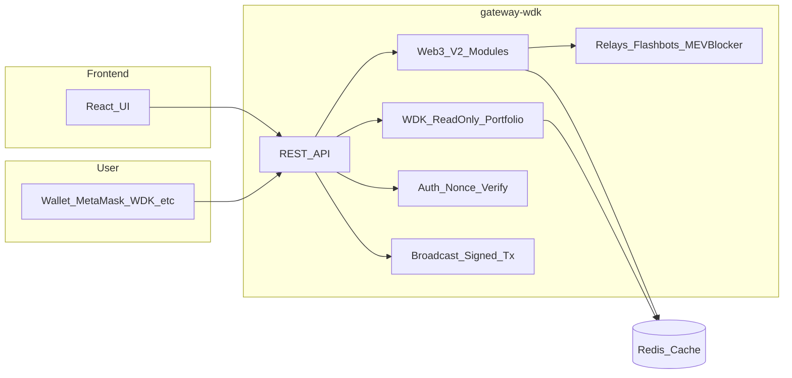
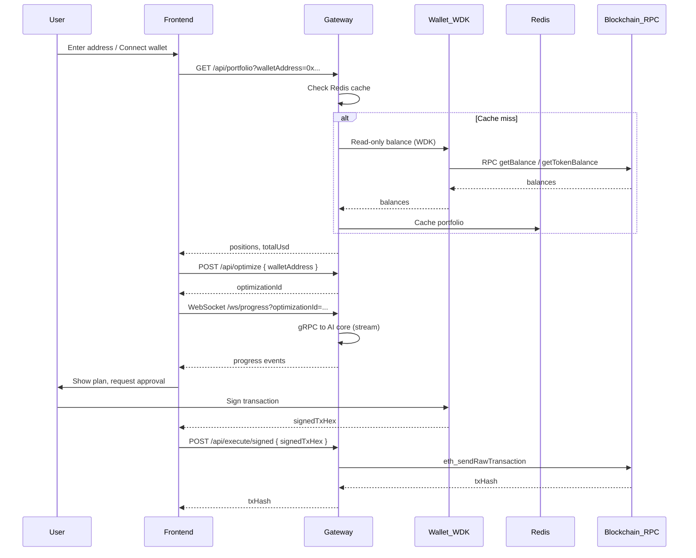

# WDK Integration

This project integrates **Tether's Wallet Development Kit (WDK)** in the gateway layer so that all wallet and transaction flows are non-custodial and consistent across supported chains.

## Where WDK is used

**gateway-wdk** (Node.js/TypeScript) is the only service that talks to WDK. It:

- Uses **read-only** wallet APIs to fetch portfolio (native + ERC-20 balances) without private keys.
- Provides auth via **Sign-In with Wallet** (nonce + signature verification).
- Accepts **signed transactions** from the client and broadcasts them (non-custodial: keys stay in the user’s wallet).

## Package and modules

- **Portfolio (read-only)**: `@tetherto/wdk-wallet-evm` – `WalletAccountReadOnlyEvm(address, { provider })` for balances.
- **Auth**: Nonce generation and signature verification (e.g. with `ethers.recoverAddress`); no WDK signer required on the server.
- **Execute**: Gateway does not sign; it only broadcasts `signedTxHex` via `eth_sendRawTransaction`. Signing is done in the browser with WDK or MetaMask.

## Architecture: non-custodial flow

- The **frontend** never has private keys; it only triggers optimize and sends the signed payload for execute.
- **All value-moving transactions** are signed in the user’s wallet; the gateway only broadcasts.

## Implementation status

| Feature | Implementation |
|--------|----------------|
| **Portfolio** | `WalletAccountReadOnlyEvm(address, { provider: RPC_URL })` for native + dynamically resolved token symbols (default `USDT,USDC`). Results cached in Redis (TTL 120s). |
| **Auth** | `GET /api/auth/nonce?walletAddress=0x...` returns nonce; `POST /api/auth/verify` with `{ walletAddress, signature, message }` verifies via `ethers.recoverAddress` and returns a session token. |
| **Execute** | Plan from AI core cached in Redis. `GET /api/execute/plan/:optimizationId` returns the plan. `POST /api/execute/signed` with `{ signedTxHex }` broadcasts via `eth_sendRawTransaction`. |
| **Web3-native v2 endpoints** | `/v2` adds dynamic chains registry, universe snapshot, oracle/pool data, positions, swap simulation, MEV relay routing, opportunities, bundles, tx audit trail, and agent autonomy state. |

### Multi-chain status (important)

- **EVM** (`ethereum`, `sepolia`, `polygon`): implemented in gateway portfolio and execution/broadcast.
- **Non‑EVM** (`solana`, `ton`, `tron`): the UI supports selecting these chains, but server-side read-only balances require the corresponding WDK wallet modules to be installed and wired. Until then, the gateway may return empty positions for these chains.

## API summary

| Method | Path | Purpose |
|--------|------|---------|
| GET | /api/portfolio?walletAddress=0x...&chainId=ethereum | Portfolio (uses WDK read-only + cache). |
| GET | /api/auth/nonce?walletAddress=0x... | Get nonce for Sign-In with Wallet. |
| POST | /api/auth/verify | Body: `walletAddress`, `signature`, `message`. Returns token. |
| POST | /api/optimize | Body: `walletAddress`, `constraints`. Returns `optimizationId`. |
| GET | /ws/progress?optimizationId=... | WebSocket stream of optimization progress. |
| GET | /api/execute/plan/:optimizationId | Cached optimization plan. |
| POST | /api/execute/signed | Body: `signedTxHex`. Broadcasts tx (non-custodial). |
| POST | /api/agent/chat | **(DEPRECATED)** Body: `message`, optional `sessionId`. Proxy to OpenClaw. |

### Web3-native v2 API (gateway)

| Method | Path | Purpose |
|--------|------|---------|
| GET | /v2/chains | Dynamic chain discovery for UI + agent. |
| GET | /v2/universe/snapshot | Data Universe snapshot (tokens/prices/optional positions). |
| GET | /v2/positions/:walletOrAgentId?chain=ethereum | Positions (portfolio alias) in v2 response shape. |
| GET | /v2/oracles/price/:tokenPair?chain=ethereum | Oracle price (Pyth→CoinGecko fallback; reconciles when both available). |
| GET | /v2/pool/:poolAddress?chain=ethereum | Pool state via EVM `eth_call` (Uniswap V2/V3 style). |
| POST | /v2/simulate/swap | Swap quote + slippage estimate (EVM Uniswap V2 `getAmountsOut`). |
| POST | /v2/protect/submit | Broadcast signed tx via public RPC or MEV relay (Flashbots Protect / MEV Blocker) depending on `protection`. |
| GET | /v2/opportunities | Opportunities list (proxied from ai-core `/assets/search?type=opportunity`). |
| POST | /v2/submit/bundle | Bundle submit (EVM Flashbots `eth_sendBundle`, Ethereum mainnet only). |
| GET | /v2/activity?wallet=... | Tx audit trail (Redis-backed; includes explorer links). |
| POST | /v2/agent/toggle | Persist agent autonomy state in Redis (UI toggle sync + future enforcement hook). |

## LangGraph and WDK

The **LangGraph Trading Orchestrator** uses the same WDK-backed gateway APIs for non-custodial execution. It replaces the deprecated OpenClaw orchestration. See [docs/LANGGRAPH_ORCHESTRATOR.md](LANGGRAPH_ORCHESTRATOR.md) for setup and architecture.

When using agentic orchestration, the agent uses the **Tether WDK skill** for wallet and transaction semantics and the **Yield-Agent MCP** tools for portfolio and optimization. Execution remains non-custodial: the agent suggests actions and the user signs in their wallet; the gateway only broadcasts.
