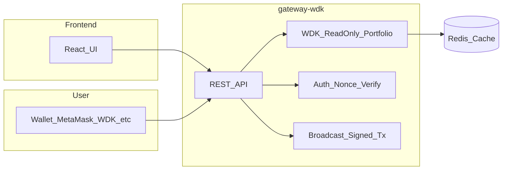
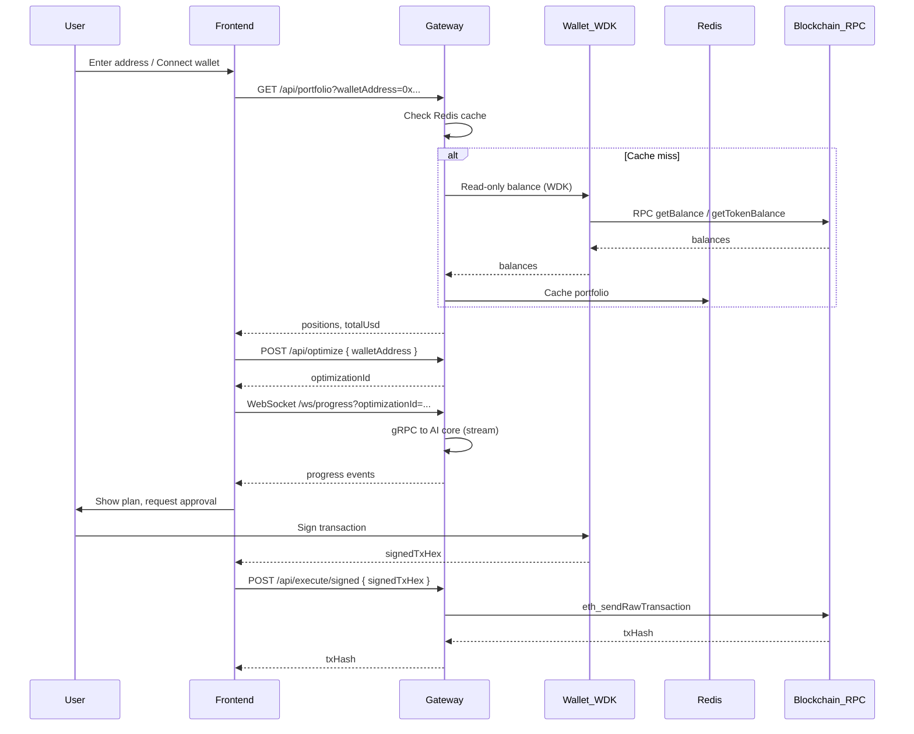

# WDK Integration

This project integrates **Tether's Wallet Development Kit (WDK)** in the gateway layer so that all wallet and transaction flows are non-custodial and consistent across supported chains.

## Where WDK is used

**gateway-wdk** (Node.js/TypeScript) is the only service that talks to WDK. It:

- Uses **read-only** wallet APIs to fetch portfolio (native + ERC-20 balances) without private keys.
- Provides auth via **Sign-In with Wallet** (nonce + signature verification).
- Accepts **signed transactions** from the client and broadcasts them (non-custodial: keys stay in the user’s wallet).

## Package and modules

- **Portfolio (read-only)**: `@tetherto/wdk-wallet-evm` – `WalletAccountReadOnlyEvm(address, { provider })` for balances.
- **Auth**: Nonce generation and signature verification (e.g. with `ethers.recoverAddress`); no WDK signer required on the server.
- **Execute**: Gateway does not sign; it only broadcasts `signedTxHex` via `eth_sendRawTransaction`. Signing is done in the browser with WDK or MetaMask.

## Architecture: non-custodial flow

- The **frontend** never has private keys; it only triggers optimize and sends the signed payload for execute.
- **All value-moving transactions** are signed in the user’s wallet; the gateway only broadcasts.

## Implementation status

| Feature | Implementation |
|--------|----------------|
| **Portfolio** | `WalletAccountReadOnlyEvm(address, { provider: RPC_URL })` for ETH, USDT, USDC. Results cached in Redis (TTL 120s). |
| **Auth** | `GET /api/auth/nonce?walletAddress=0x...` returns nonce; `POST /api/auth/verify` with `{ walletAddress, signature, message }` verifies via `ethers.recoverAddress` and returns a session token. |
| **Execute** | Plan from AI core cached in Redis. `GET /api/execute/plan/:optimizationId` returns the plan. `POST /api/execute/signed` with `{ signedTxHex }` broadcasts via `eth_sendRawTransaction`. |

## API summary

| Method | Path | Purpose |
|--------|------|---------|
| GET | /api/portfolio?walletAddress=0x...&chainId=ethereum | Portfolio (uses WDK read-only + cache). |
| GET | /api/auth/nonce?walletAddress=0x... | Get nonce for Sign-In with Wallet. |
| POST | /api/auth/verify | Body: `walletAddress`, `signature`, `message`. Returns token. |
| POST | /api/optimize | Body: `walletAddress`, `constraints`. Returns `optimizationId`. |
| GET | /ws/progress?optimizationId=... | WebSocket stream of optimization progress. |
| GET | /api/execute/plan/:optimizationId | Cached optimization plan. |
| POST | /api/execute/signed | Body: `signedTxHex`. Broadcasts tx (non-custodial). |
